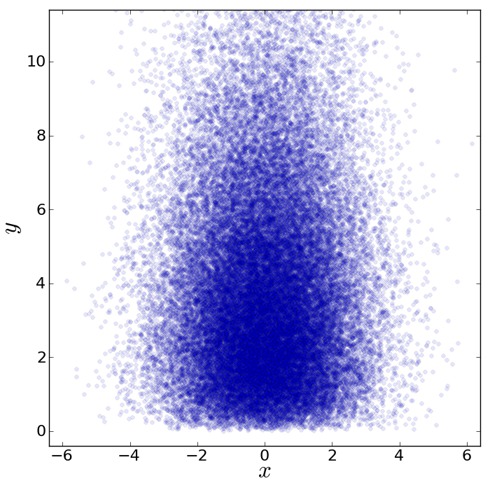
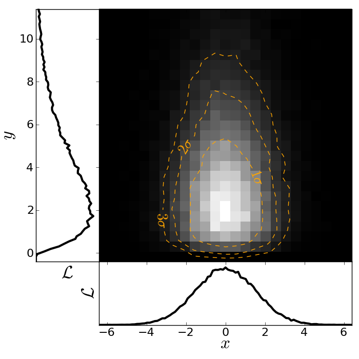

Code Examples
=============

This page contains many examples of applications of Python scripts to Astronomy

Hello, world
------------

The following is from "myfile.py".  
::

    def hello(name="John"):
        print "Hello, "+name
                                                                                
    def array_hello(names=["Tom", "Dick", "Harry"]):
        for name in names:
            print "Hello, "+name

Run the functions by inside python typing
::

>>> import myfile
>>> myfile.hello()
>>> myfile.array_hello()

Parallel process of FITS images
-------------------------------

::

    import glob
    import multiprocessing

    import pyfits
    from scipy.ndimage import gaussian_filter

    # Define a function to run on files
    def smooth(filename):

        # Read in FITS file
        hdulist = pyfits.open(filename)

        # Convolve the data in the primary HDU
        hdulist[0].data = gaussian_filter(hdulist[0].data, 3)

        # Write out the result to a new file
        hdulist.writeto(filename.replace('.fits', '_smooth.fits'))

    # Search for all FITS files
    files = glob.glob('files/*.fits')

    # Define a 'pool' of 16 processors
    p = multiprocessing.Pool(processes=16)

    # Run the function over all files in parallel
    ap.map(smooth, files)

Making a fancy plot from Monte-Carlo samples
----------------------------------

Assume you have run an MCMC and you are left with two arrays X,Y of MCMC samples of two fit parameters. You now want to use X,Y to visualise the likelihood manifold. You can do that (a) as a simple scatter plot or (b) in a more fancy way.

Instead of Monte-Carlo samples, you could also be faced with distributions of any two parameters, such as effective temperature and surface gravity of a set of stars, or redshift and magnitude of a set of galaxies.

First, let us create some artificial toy data to mimick the output of an MCMC algorithm in some science application::

  import numpy,math
  import matplotlib.pyplot as plt
  import matplotlib.gridspec as gridspec

  # Create artificial data mimicking some MCMC results.
  N = 50000
  X = numpy.random.normal(0.0, 1.5, N)  # Draw N samples from normal distribution
  Y = numpy.random.gamma(2.0, 2.0, N)   # Draw N samples from Gamma distribution

Second, let us create a simple plot by plainly plotting x vs. y. This is very easy and we can recap some of the basic Python plotting commands::

  # Define plot ranges at beginning, since used often later.
  YRANGE = [-0.4,11.4]
  XRANGE = [-6.4,6.4]

  # Define figure size and formatting
  fig = plt.figure(1, figsize=(7,7))
  fig.subplots_adjust(left=0.10, bottom=0.09, top=0.98, right=0.98)

  # Simply plot X vs. Y as data points.
  plt.plot(X, Y, 'o', ms=4, alpha=0.1, color='blue')

  # Set plot ranges, axes ticks and axes labels.
  plt.xlim(XRANGE)                 # Set x plot range.
  plt.ylim(YRANGE)                 # Set y plot range.
  plt.xticks(fontsize=16)          # Set ticks x axis.
  plt.yticks(fontsize=16)          # Set ticks y axis.
  plt.xlabel(r'$x$', fontsize=24)  # Set label x axis.
  plt.ylabel(r'$y$', fontsize=24)  # Set label y axis.

  plt.savefig('plot_MCMC_samples_plain.png') # Save png file.

The result looks like this:

Now, we would like to make this plot a little fancier. Our wish list is:

- We would like to see the density in the crowded regions!
- smoothed distribution instead of single points
- contours of confidence levels
- projected distributions of both parameters as side panels

The result should look like this:

Here is the code showing how to do this. We start by the top right panel, which is the main panel::

  fig = plt.figure(2, figsize=(7,7))
  fig.subplots_adjust(hspace=0.001, wspace=0.001, left=0.10, bottom=0.095, top=0.975, right=0.98)
  # gridspec enables you to assign different formats to panels in one plot.
  gs = gridspec.GridSpec(2, 2, width_ratios=[1,4], height_ratios=[4,1])

  plt.subplot(gs[1]) # Main panel top right contains full 2D histogram.
  # Convert to 2d histogram.
  Bins = 25
  hist2D, xedges, yedges = numpy.histogram2d(X, Y, bins=[Bins,Bins], range=[XRANGE,YRANGE],
      normed=False)

  # Plot Monte-Carlo samples as 2D histogram.
  hist2D = numpy.transpose(hist2D)  # Beware: numpy switches axes, so switch back.
  plt.pcolormesh(xedges, yedges, hist2D, cmap=plt.cm.gray)

  # Overplot with error contours 1,2,3 sigma.
  maximum    = numpy.max(hist2D)
  [L1,L2,L3] = [0.5*maximum,0.25*maximum,0.125*maximum]  # Replace with a proper code!
  # Use bin edges to restore extent.
  extent = [xedges[0],xedges[-1], yedges[0],yedges[-1]]
  cs = plt.contour(hist2D, extent=extent, levels=[L1,L2,L3], linestyles=['--','--','--'], 
      colors=['orange','orange','orange'], linewidths=1)
  # use dictionary in order to assign your own labels to the contours.
  fmtdict = {L1:r'$1\sigma$',L2:r'$2\sigma$',L3:r'$3\sigma$'}
  plt.clabel(cs, fmt=fmtdict, inline=True, fontsize=20)

  plt.xlim(XRANGE)
  plt.ylim(YRANGE)

Finally, add the two side panels showing the projected distributions of X and Y::

  # Bin X,Y separately. As 1D bin, can use more bins now.
  S  = 101
  LX = numpy.histogram(X, bins=S, range=XRANGE, normed=True)[0]
  LY = numpy.histogram(Y, bins=S, range=YRANGE, normed=True)[0]
  # Restore positions lost by binning.
  X = XRANGE[0] + (XRANGE[1]-XRANGE[0])*numpy.array(range(0,len(LX)))/float(len(LX)-1)
  Y = YRANGE[0] + (YRANGE[1]-YRANGE[0])*numpy.array(range(0,len(LY)))/float(len(LY)-1)

  # bottom right panel: projected density of x.
  plt.subplot(gs[3])
  plt.plot(X, LX, '-', lw=3, color='black')

  plt.xticks(fontsize=16)
  plt.yticks([])
  plt.xlabel(r'$x$', fontsize=24)
  plt.ylabel(r'$\cal L$', fontsize=24)
  plt.xlim(XRANGE)
  plt.ylim(0.0, 1.1*numpy.max(LX))

  # top left panel: projected density of y.
  plt.subplot(gs[0])
  plt.plot(LY, Y, '-', lw=3, color='black')

  plt.yticks(fontsize=16)
  plt.xticks([])
  plt.xlabel(r'$\cal L$', fontsize=24)
  plt.ylabel(r'$y$', fontsize=24)
  plt.xlim(0.0, 1.1*numpy.max(LY))
  plt.ylim(YRANGE)

  plt.savefig('plot_MCMC_samples_fancy.png')
  plt.show()

Reading text files and plotting 
-------------------------------

Plot the space and redshift distribution of the luminous red galaxies
(LRGs) from the catalogue here:
http://www.2slaq.info/2SLAQ_LRG_v5pub.cat::

  import numpy as np
  import matplotlib.pyplot as plt
  from scipy import integrate
  from math import sqrt
   
  # Cosmological parameters needed to convert redshift to distance   
  H0 = 70.    # Hubble parameter at z=0, km/s/Mpc
  omega_m = 0.3
  omega_lam = 0.7
  c_kms = 299792.458 # speed of light, km/s
  dH = c_kms / H0    # Hubble distance, Mpc
   
  def inv_efunc(z):
      """ Used to calculate the comoving distance to object at redshift
      z. Eqn 14 from Hogg, astro-ph/9905116."""
      zp1 = 1. + z
      return 1. / sqrt(omega_m*zp1**3 + omega_lam)
   
  # Read the LRG positions, magnitudes and redshifts
  #
  # dtype=None means the type of each column (float, integer, string)
  # will be guessed. 
  r = np.genfromtxt('2SLAQ_LRG_v5pub.cat', dtype=None, skip_header=176,
                    names='name,z,rmag,RA,Dec',usecols=(0, 12, 26, 27, 28))
   
  # Only keep objects with a redshift larger than 0.1
  r = r[r['z'] > 0.1]
   
  # Calculate the comoving distance corresponding to each object's redshift
  dist = np.array([dH * integrate.quad(inv_efunc, 0, z)[0] for z in r['z']])
   
  # Plot the distribution of LRGs, converting redshifts to positions
  # assuming Hubble flow.
  theta = r['RA'] * np.pi / 180  # radians
  x = dist * np.cos(theta)
  y = dist * np.sin(theta)

  # Make the area of each circle representing an LRG position
  # proportional to its apparent r-band luminosity.
  sizes = 30 * 10**-((r['rmag'] - np.median(r['rmag']))/ 2.5)   
  fig = plt.figure()
  ax = fig.add_subplot(111)

  # Plot the LRGs, colouring by declination.
  col = plt.scatter(x, y, marker='.', s=sizes, c=r['Dec'], faceted=0,
           	    cmap=plt.cm.Spectral)
  # add a colourbar.
  cax = fig.colorbar(col)
  cax.set_label('Declination (degrees)')
  plt.xlabel('Comoving Mpc')
  plt.ylabel('Comoving Mpc')
  plt.axis('equal')

  # Now plot the redshift distribution.
  zbins = np.arange(0.25, 0.9, 0.05)
  fig = plt.figure()
  ax = fig.add_subplot(111)
  plt.hist(r['z'], bins=zbins)
  plt.xlabel('LRG redshift')
   
  # Make a second axis to plot the comoving distance
  ax1 = plt.twiny(ax)
   
  # Generate redshifts corresponding to distance tick positions;
  # first get a curve giving Mpc as a function of redshift
  redshifts = np.linspace(0, 2., 1000)
  dist = [dH * integrate.quad(inv_efunc, 0, z)[0] for z in redshifts]
  Mpcvals = np.arange(0, 4000, 500)

  # Then interpolate to the redshift values at which we want ticks.
  Mpcticks = np.interp(Mpcvals, dist, redshifts)
  ax1.set_xticks(Mpcticks)
  ax1.set_xticklabels([str(v) for v in Mpcvals])

  # Make both axes have the same start and end point.
  ax1.set_xlim(*ax.get_xlim())
  ax1.set_xlabel('Comoving distance (Mpc)')

  plt.show()
