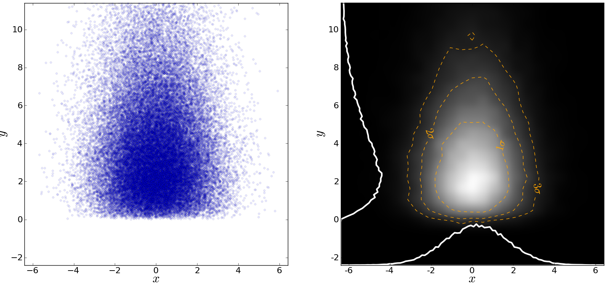

Code Examples
=============

This page contains many examples of applications of Python scripts to Astronomy

Hello, world
------------

The following is from "myfile.py".  
::

    def hello(name="John"):
        print "Hello, "+name
                                                                                
    def array_hello(names=["Tom", "Dick", "Harry"]):
        for name in names:
            print "Hello, "+name

Run the functions by inside python typing
::

>>> import myfile
>>> myfile.hello()
>>> myfile.array_hello()

Parallel process of FITS images
-------------------------------

::

    import glob
    import multiprocessing

    import pyfits
    from scipy.ndimage import gaussian_filter

    # Define a function to run on files
    def smooth(filename):

        # Read in FITS file
        hdulist = pyfits.open(filename)

        # Convolve the data in the primary HDU
        hdulist[0].data = gaussian_filter(hdulist[0].data, 3)

        # Write out the result to a new file
        hdulist.writeto(filename.replace('.fits', '_smooth.fits'))

    # Search for all FITS files
    files = glob.glob('files/*.fits')

    # Define a 'pool' of 16 processors
    p = multiprocessing.Pool(processes=16)

    # Run the function over all files in parallel
    ap.map(smooth, files)

Making a fancy plot from Monte-Carlo samples
----------------------------------

Assume you have run an MCMC and you are left with two arrays X,Y of
MCMC samples of two fit parameters. You now want to use X,Y to
visualise the likelihood manifold. You can do that (a) as a simple
scatter plot or (b) in a more fancy way::

  import numpy,math
  import pylab

  # Create artificial data mimicking some MCMC results.
  N = 50000
  X = numpy.random.normal(0.0, 1.5, N)  # Normal distribution
  Y = numpy.random.gamma(2.0, 2.0, N)   # Gamma distribution

  # Define plot ranges once, for multiple usage later (e.g. more than a single subplot).
  XRANGE = [-6.4,6.4]
  YRANGE = [-2.4,11.4]

  # Define figure size and formatting
  fig = pylab.figure(1, figsize=(16,7.5))
  fig.subplots_adjust(wspace=0.2, left=0.04, bottom=0.07, top=0.99, right=0.99)

  # Two subplots next to each other. Start with left subplot.
  pylab.subplot(121)
  # Simply plot X vs. Y as data points.
  pylab.plot(X, Y, 'o', ms=4, alpha=0.1, color='blue')

  pylab.xlim(XRANGE)
  pylab.ylim(YRANGE)
  pylab.xticks(fontsize=16)
  pylab.yticks(fontsize=16)
  pylab.xlabel(r'$x$', fontsize=24)
  pylab.ylabel(r'$y$', fontsize=24)

  # Next, make right subplot.
  pylab.subplot(122)

  # Convert to 2d histogram.
  B      = 25
  hist2D = numpy.histogram2d(X, Y, bins=[B,B], range=[XRANGE,YRANGE], normed=False)[0]

  # Plot Monte-Carlo samples as 2D histogram.
  # Beware: imshow switches axes, so switch back.
  hist2D = numpy.transpose(hist2D)
  pylab.imshow(hist2D, cmap=pylab.cm.gray, interpolation='gaussian')

  # Overplot with error contours 1,2,3 sigma.
  maximum    = numpy.max(hist2D)
  # Infering correct levels of 1,2,3 sigma would require some further code,
  # so let's fake it by setting the three levels to some guessed values.
  [L1,L2,L3] = [0.5*maximum,0.25*maximum,0.125*maximum]
  #print [L1,L2,L3]
  cs = pylab.contour(hist2D, levels=[L1,L2,L3], linestyles=['--','--','--'], colors=['orange','orange','orange'], linewidths=1)
  # use dictionary in order to assign my own labels to the contours.
  fmtdict = {L1:r'$1\sigma$',L2:r'$2\sigma$',L3:r'$3\sigma$'}
  pylab.clabel(cs, fmt=fmtdict, inline=True, fontsize=20)

  # Also plot marginal likelihoods.
  S  = 101
  I  = []
  # Bin X,Y separately. As 1D bin, can use more bins now.
  LX = numpy.histogram(X, bins=S, range=XRANGE, normed=True)[0]
  LY = numpy.histogram(Y, bins=S, range=YRANGE, normed=True)[0]
  # Rescale by maxima. Don't want this histogram to span whole subplot.
  rescale_X = 0.15*float(B)/numpy.max(LX)
  rescale_Y = 0.15*float(B)/numpy.max(LY)
  for s in range(S):
	  I.append(float(s)*float(B)/float(S))
	  LX[s] = LX[s]*rescale_X
	  LY[s] = LY[s]*rescale_Y
  pylab.plot(I, LX, '-', lw=3, color='white')
  pylab.plot(LY, I, '-', lw=3, color='white')

  pylab.xlim(0,B-1)
  pylab.ylim(0,B-1)

  # Sadly, through binning numpy looses the position information, so we need to restore it manually
  # in order to plot proper axes ticks.
  T = []
  L = []
  for x in -6,-4,-2,0,2,4,6:
	  index = (x-XRANGE[0])*float(B-1)/(XRANGE[1] - XRANGE[0])
	  T.append(index)
	  L.append(x)
  pylab.xticks(T, L, fontsize=16)

  T = []
  L = []
  for y in -2,0,2,4,6,8,10:
	  index = (y-YRANGE[0])*float(B-1)/(YRANGE[1] - YRANGE[0])
	  T.append(index)
	  L.append(y)
  pylab.yticks(T, L, fontsize=16)

  pylab.xlabel(r'$x$', fontsize=24)
  pylab.ylabel(r'$y$', fontsize=24)

  pylab.savefig('plot_MCMC_samples.png')  # Save figure as png-file.
  pylab.show()

Reading text files and plotting 
-------------------------------

Plot the space and redshift distribution of the luminous red galaxies
(LRGs) from the catalogue here:
http://www.2slaq.info/2SLAQ_LRG_v5pub.cat::

  import numpy as np
  import matplotlib.pyplot as plt
  from scipy import integrate
  from math import sqrt
   
  # Cosmological parameters needed to convert redshift to distance   
  H0 = 70.    # Hubble parameter at z=0, km/s/Mpc
  omega_m = 0.3
  omega_lam = 0.7
  c_kms = 299792.458 # speed of light, km/s
  dH = c_kms / H0    # Hubble distance, Mpc
   
  def inv_efunc(z):
      """ Used to calculate the comoving distance to object at redshift
      z. Eqn 14 from Hogg, astro-ph/9905116."""
      zp1 = 1. + z
      return 1. / sqrt(omega_m*zp1**3 + omega_lam)
   
  # Read the LRG positions, magnitudes and redshifts
  #
  # dtype=None means the type of each column (float, integer, string)
  # will be guessed. 
  r = np.genfromtxt('2SLAQ_LRG_v5pub.cat', dtype=None, skip_header=176,
                    names='name,z,rmag,RA,Dec',usecols=(0, 12, 26, 27, 28))
   
  # Only keep objects with a redshift larger than 0.1
  r = r[r['z'] > 0.1]
   
  # Calculate the comoving distance corresponding to each object's redshift
  dist = np.array([dH * integrate.quad(inv_efunc, 0, z)[0] for z in r['z']])
   
  # Plot the distribution of LRGs, converting redshifts to positions
  # assuming Hubble flow.
  theta = r['RA'] * np.pi / 180  # radians
  x = dist * np.cos(theta)
  y = dist * np.sin(theta)

  # Make the area of each circle representing an LRG position
  # proportional to its apparent r-band luminosity.
  sizes = 30 * 10**-((r['rmag'] - np.median(r['rmag']))/ 2.5)   
  fig = plt.figure()
  ax = fig.add_subplot(111)

  # Plot the LRGs, colouring by declination.
  col = plt.scatter(x, y, marker='.', s=sizes, c=r['Dec'], faceted=0,
           	    cmap=plt.cm.Spectral)
  # add a colourbar.
  cax = fig.colorbar(col)
  cax.set_label('Declination (degrees)')
  plt.xlabel('Comoving Mpc')
  plt.ylabel('Comoving Mpc')
  plt.axis('equal')

  # Now plot the redshift distribution.
  zbins = np.arange(0.25, 0.9, 0.05)
  fig = plt.figure()
  ax = fig.add_subplot(111)
  plt.hist(r['z'], bins=zbins)
  plt.xlabel('LRG redshift')
   
  # Make a second axis to plot the comoving distance
  ax1 = plt.twiny(ax)
   
  # Generate redshifts corresponding to distance tick positions;
  # first get a curve giving Mpc as a function of redshift
  redshifts = np.linspace(0, 2., 1000)
  dist = [dH * integrate.quad(inv_efunc, 0, z)[0] for z in redshifts]
  Mpcvals = np.arange(0, 4000, 500)

  # Then interpolate to the redshift values at which we want ticks.
  Mpcticks = np.interp(Mpcvals, dist, redshifts)
  ax1.set_xticks(Mpcticks)
  ax1.set_xticklabels([str(v) for v in Mpcvals])

  # Make both axes have the same start and end point.
  ax1.set_xlim(*ax.get_xlim())
  ax1.set_xlabel('Comoving distance (Mpc)')

  plt.show()
