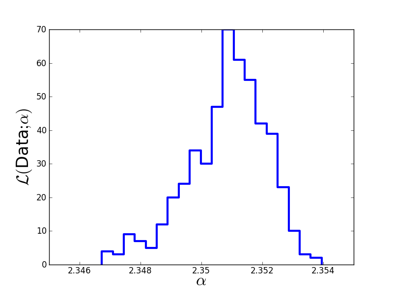

Hamiltonian Monte-Carlo
=======================

Drawback of Metropolis-Hastings
-------------

When implementing the Metropolis-Hastings algorithm, you may have noticed the influence of the stepsize parameter:

* Is the stepsize too large, no candidates are accepted and we never move away from the initial guess.
* Is the stepsize too small, all candidates are accepted and we have a random walk going nowhere.

Obviously, the stepsize needs to be chosen very carefully in order to make the algorithm efficient.

In particular, we must not change the stepsizes while running the Metropolis-Hastings algorithm. This would violate "detailed balance" and thus destroy the Markov property (density no longer proportional to likelihood).

If we have many fit parameters, every single one will have its own stepsize that needs to be fine tuned. This can become a cumbersome task.

Therefore, other MCMC algorithms have been developed, which either tune the stepsizes automatically (e.g. slice sampling) or do not have any stepsizes at all (e.g. Gibbs sampling).

Let us now consider Hamiltonian Monte-Carlo, which still involves a single stepsize but improves efficiency by making use of gradients of the objective function and ''Hamiltonian dynamics''.

Hamiltonian Monte-Carlo - the algorithm
--------------------

First, we need to compute the gradient of our objective function, i.e., of the log-likelihood:

  :math:`\frac{\partial\log\mathcal L}{\partial\alpha} = -D-\frac{N}{1-\alpha}\left[1 + \frac{1-\alpha}{M_{max}^{1-\alpha}-M_{min}^{1-\alpha}}\left(M_{min}^{1-\alpha}\log M_{min}-M_{max}^{1-\alpha}\log M_{max}\right)\right]`

The gradient in Python::
  
  # Define gradient of log-likelihood.
  def evaluateGradient(params, D, N, M_min, M_max, log_M_min, log_M_max):
      alpha = params[0]  # extract alpha
      grad = logMmin*math.pow(M_min, 1.0-alpha) 
              - logMmax*math.pow(M_max, 1.0-alpha)
      grad = 1.0 + grad*(1.0 - alpha)/(math.pow(M_max, 1.0-alpha) 
              - math.pow(M_min, 1.0-alpha))
      grad = -D - N*grad/(1.0 - alpha)
      return numpy.array(grad)
  
Hamiltonian Monte-Carlo makes use of the fact, that we can write our likelihood as

  :math:`\mathcal L = e^{\log\mathcal L} = e^{-E}`

where :math:`E=-\log\mathcal L` is the ''energy''. The algorithm then uses Hamiltonian dynamics to modify the way how candidates are proposed::

  log_M_min  = math.log(1.0)
  log_M_max  = math.log(100.0)
  # Initial guess for alpha as array.
  guess = [3.0]
  # Prepare storing MCMC chain.
  A = [guess]
  # define stepsize of MCMC.
  stepsize = 0.000047
  accepted = 0.0
  
  import copy
  
  # Hamiltonian Monte-Carlo.
  for n in range(10000):
      old_alpha  = A[len(A)-1]
      # Remember, energy = -loglik
      old_energy = -evaluateLogLikelihood(old_alpha, D, N, M_min, 
                        M_max)
      old_grad   = -evaluateGradient(old_alpha, D, N, M_min,  
                        M_max, log_M_min, log_M_max)
      
      new_alpha = copy.copy(old_alpha)  # deep copy of array
      new_grad  = copy.copy(old_grad)   # deep copy of array
      # Suggest new candidate using gradient + Hamiltonian dynamics.
      # draw random momentum vector from unit Gaussian.
      p = random.gauss(0.0, 1.0)
      H = numpy.dot(p,p)/2.0 + old_energy    # compute Hamiltonian
      
      # Do 5 Leapfrog steps.
      for tau in range(5):
          # make half step in p
          p         = p - stepsize*new_grad/2.0
          # make full step in alpha
          new_alpha = new_alpha + stepsize*p
          # compute new gradient
          new_grad  = -evaluateGradient(old_alpha, D, N, M_min,  
                           M_max, log_M_min, log_M_max)
          # make half step in p
          p         = p - stepsize*new_grad/2.0
      
      # Compute new Hamiltonian. Remember, energy = -loglik.
      new_energy = -evaluateLogLikelihood(new_alpha, D, N, M_min,
                       M_max)
      newH       = numpy.dot(p,p)/2.0 + new_energy
      dH         = newH - H
      
      # Accept new candidate in Monte-Carlo fashion.
      if (dH < 0.0):
          A.append(new_alpha)
          accepted = accepted + 1.0
      else:
          u = random.uniform(0.0,1.0)
          if (u < math.exp(-dH)):
              A.append(new_alpha)
              accepted = accepted + 1.0
          else:
              A.append(old_alpha)

  print "Acceptance rate = "+str(accepted/float(len(A)))

Plot the results::

  # Discard first half of MCMC chain and thin out the rest.
  Clean = []
  for n in range(len(A)/2,len(A)):
      if (n % 10 == 0):
          Clean.append(A[n][0])

  # Print Monte-Carlo estimate of alpha.
  print "Mean:  "+str(numpy.mean(Clean))
  print "Sigma: "+str(numpy.std(Clean))
  
  plt.figure(1)
  plt.hist(Clean, 20, histtype='step', lw=3)
  plt.xticks([2.346,2.348,2.35,2.352,2.354],
             [2.346,2.348,2.35,2.352,2.354])
  plt.xlim(2.345,2.355)
  plt.xlabel(r'$\alpha$', fontsize=24)
  plt.ylabel(r'$\cal L($Data$;\alpha)$', fontsize=24)
  plt.savefig('example-HamiltonianMC-results.png')

The true value we used to generate the data was :math:`\alpha=2.35`. The Monte-Carlo estimate is :math:`\hat\alpha=2.3507\pm 0.0014`. Here is the estimated likelihood of :math:`\alpha`.

