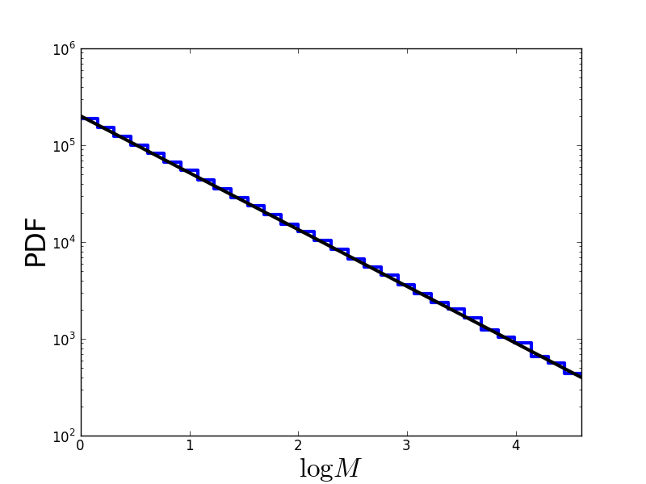

Additional material: Monte-Carlo sampling from Salpeter SMF
========================

Drawing samples from a given probability distribution is a very common task. We would like to draw samples from the likelihood distribution of the fit parameters.

In our case, we want to simulate data of stellar mass measurements.

Monte-Carlo methods can sample from any given probability distribution. The general outline of a Monte-Carlo algorithm is to first draw some candidate values from some proposal distribution and second to accept or reject this candidate randomly given the probability distribution.

There are numerous different versions of Monte-Carlo methods. See chapter 29 in `MacKay's ITILA <http://www.inference.phy.cam.ac.uk/mackay/itila/book.html>`_ for a nice overview.

Let us implement a Python function that draws Monte-Carlo samples from a Salpeter SMF, given a value of :math:`\alpha` and a mass interval::

  import numpy,math
  import matplotlib.pyplot as plt
  import random as random

  random.seed(1)  # set random seed.
  
  # Draw random samples from Salpeter IMF.
  # N     ... number of samples.
  # alpha ... power-law index.
  # M_min ... lower bound of mass interval.
  # M_max ... upper bound of mass interval.
  def sampleFromSalpeter(N, alpha, M_min, M_max):
      # Convert limits from M to logM.
      log_M_Min = math.log(M_min)
      log_M_Max = math.log(M_max)
      # Since Salpeter SMF decays, maximum likelihood occurs at M_min
      maxlik = math.pow(M_min, 1.0 - alpha)
      
      # Prepare array for output masses.
      Masses = []
      # Fill in array.
      while (len(Masses) < N):
          # Draw candidate from logM interval.
          logM = random.uniform(log_M_Min,log_M_Max)
          M    = math.exp(logM)
          # Compute likelihood of candidate from Salpeter SMF.
          likelihood = math.pow(M, 1.0 - alpha)
          # Accept randomly.
          u = random.uniform(0.0,maxlik)
          if (u < likelihood):
              Masses.append(M)
      return Masses

Note that this implementation draws its candidates from a uniform distribution over :math:`\log M` instead of :math:`M`. This is computationally much more efficient, which is due to the mathematical form of the Salpeter SMF that decays quickly with increasing mass.

Let us draw a million stellar masses and check the outcome::

  # Draw samples.
  Masses = sampleFromSalpeter(1000000, 2.35, 1.0, 100.0)
  # Convert to logM.
  LogMasses = numpy.log(numpy.array(Masses))

  # Plot distribution.
  plt.figure(1)
  plt.hist(LogMasses, 30, histtype='step', lw=3, log=True,
           range=(0.0,math.log(100.0)))
  # Overplot with Salpeter SMF.
  X = []
  Y = []
  for n in range(101):
      logM = math.log(100.0)*float(n)/100.0
      x    = math.exp(logM)
      y    = 2.0e5*math.pow(x, 1.0-2.35)  # normalisation
      X.append(logM)
      Y.append(y)
  plt.plot(X, Y, '-', lw=3, color='black')
  plt.xlim(0.0,math.log(100.0))
  plt.xlabel(r'$\log M$', fontsize=24)
  plt.ylabel('PDF', fontsize=24)
  plt.savefig('example-Monte-Carlo-sampling-from-Salpeter.png')
  plt.show()

The resulting distribution looks like this (in log-log space, a power-law is a straight line):

Problems of Monte-Carlo sampling
--------------------

If we were to plot :math:`\log\mathcal L(\{M_1,M_2,\ldots,M_N\};\alpha)` as a function of :math:`\alpha`, we would realise that it has a single extremely sharp peak.

This is a huge problem for Monte-Carlo sampling, because the likelihood is essentially zero everywhere, except at this single sharp peak. The chance that our proposal distribution hits a value at this peak tends towards zero. Consequently, we cannot estimate :math:`\alpha` by drawing Monte-Carlo samples from :math:`\log\mathcal L(\{M_1,M_2,\ldots,M_N\};\alpha)`.

In general, there is also an even more severe problem: Monte-Carlo methods such as the one we discussed before only work in one dimension. If we have more than one fit parameter, i.e., if we need to draw samples from PDFs over high-dimensional parameter spaces, these Monte-Carlo methods quickly become computationally infeasible. (See Sect. 29.3 in `MacKay's ITILA <http://www.inference.phy.cam.ac.uk/mackay/itila/book.html>`_ for a runtime analysis.)
