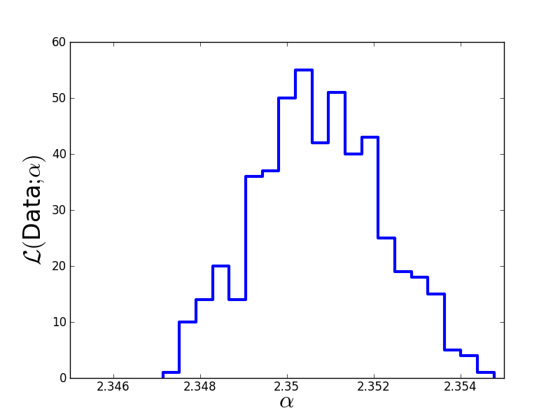

Metropolis-Hastings algorithm
===========================

Salpeter likelihood function
--------------------

We just saw that Monte-Carlo methods can draw samples from any probability distribution. In the former case, that probability distribution was the Salpeter mass function, from which we sampled stellar masses.

Now, our goal is to learn the probability distribution of :math:`\alpha`, given some data (the posterior probability). In fact, we are happy to only infer the likelihood function here. Unfortunately, this now requires some math.

We assume that we are given :math:`N` i.i.d. samples of stellar masses (with negligible errors on the measurements). In that case, the likelihood of the problem is

  :math:`\mathcal L(\{M_1,M_2,\ldots,M_N\};\alpha) = \prod_{n=1}^N p(M_n|\alpha) = \prod_{n=1}^N c\left(\frac{M_n}{M_\odot}\right)^{-\alpha}`

We can evaluate the normalisation constant by integrating over the observation interval :math:`[M_{min},M_{max}]`:

  :math:`\int_{M_{min}}^{M_{max}}dM c M^{-\alpha} = c\frac{M_{max}^{1-\alpha}-M_{min}^{1-\alpha}}{1-\alpha}=1`

There are two simplifying assumptions in this approach:

* We neglect errors of stellar mass observations :math:`M_n`.
* We assume that :math:`[M_{min},M_{max}]` are known.

Instead of :math:`\mathcal L`, once usually considers :math:`\log\mathcal L`, which is numerically more stable and usually also simplifies the math,
  
  :math:`\log\mathcal L(\{M_1,M_2,\ldots,M_N\};\alpha) = N\log c -\alpha \sum_{n=1}^N \log\left(\frac{M_n}{M_\odot}\right)`
  :math:`\phantom{\log\mathcal L(\{M_1,M_2,\ldots,M_N\};\alpha)}= N\log\left(\frac{1-\alpha}{M_{max}^{1-\alpha}-M_{min}^{1-\alpha}}\right)-\alpha \sum_{n=1}^N \log\left(\frac{M_n}{M_\odot}\right)`

There are two important things to note carefully about this log-likelihood function:

* It is not a least-squares problem.
* The data only enters via :math:`D=\sum_{n=1}^N \log\left(\frac{M_n}{M_\odot}\right)`, which is completely independent of the fit parameter :math:`\alpha` and can be computed once at beginning. Therefore, handling huge datasets such as a Gaia catalogue is no problem at all!

Markov-chain Monte-Carlo (MCMC) sampling
--------------------

MCMC is an iterative algorithm. We provide a first value - an initial guess - and then look for better values in a Monte-Carlo fashion.

Basic idea of MCMC: Chain is an iteration, i.e., a set of points. Density of points is directly proportional to likelihood. (In brute-force grids, likelihood values at points map manifold.)

MCMC is NOT a greedy algorithm, but can theoretically explore the whole manifold if run for infinite time.

BONUS: MCMC not only provides best-fit values but also uncertainty estimates via scatter of chain.

Metropolis-Hastings algorithm
---------------------

There are numerous MCMC algorithms. For the moment, we only consider the Metropolis-Hastings algorithm, which is the simplest type of MCMC. See chapters 29 and 30 in `MacKay's ITILA <http://www.inference.phy.cam.ac.uk/mackay/itila/book.html>`_ for a very nice introduction to Monte-Carlo algorithms.

We continue the previous code that drew samples from the Salpeter SMF and start implementation with the definition of the log-likelihood function and the toy data::
  
  # Define logarithmic likelihood function.
  # params ... array of fit params, here just alpha
  # D      ... sum over log(M_n)
  # N      ... number of data points.
  # M_min  ... lower limit of mass interval
  # M_max  ... upper limit of mass interval
  def evaluateLogLikelihood(params, D, N, M_min, M_max):
      alpha = params[0]  # extract alpha
      # Compute normalisation constant.
      c = (1.0 - alpha)/(math.pow(M_max, 1.0-alpha) 
                          - math.pow(M_min, 1.0-alpha))
      # return log likelihood.
      return N*math.log(c) - alpha*D
  
  # Generate toy data.
  N      = 1000000  # Draw 1 Million stellar masses.
  alpha  = 2.35
  M_min  = 1.0
  M_max  = 100.0
  Masses = sampleFromSalpeter(N, alpha, M_min, M_max)
  LogM   = numpy.log(numpy.array(Masses))
  D      = numpy.mean(LogM)*N

Now follows the actual Metropolis-Hastings algorithm (for arbitrary number of fit parameters)::

  # initial guess for alpha as array.
  guess = [3.0]
  # Prepare storing MCMC chain as array of arrays.
  A = [guess]
  # define stepsize of MCMC.
  stepsizes = [0.005]  # array of stepsizes
  accepted  = 0.0
  
  # Metropolis-Hastings with 10,000 iterations.
  for n in range(10000):
      old_alpha  = A[len(A)-1]  # old parameter value as array
      old_loglik = evaluateLogLikelihood(old_alpha, D, N, M_min, 
                      M_max)
      # Suggest new candidate from Gaussian proposal distribution.
      new_alpha = numpy.zeros([len(old_alpha)])
      for i in range(len(old_alpha)):
          # Use stepsize provided for every dimension.
          new_alpha[i] = random.gauss(old_alpha[i], stepsizes[i])
      new_loglik = evaluateLogLikelihood(new_alpha, D, N, M_min, 
                      M_max)
      # Accept new candidate in Monte-Carlo fashing.
      if (new_loglik > old_loglik):
          A.append(new_alpha)
          accepted = accepted + 1.0  # monitor acceptance
      else:
          u = random.uniform(0.0,1.0)
          if (u < math.exp(new_loglik - old_loglik)):
              A.append(new_alpha)
              accepted = accepted + 1.0  # monitor acceptance
          else:
              A.append(old_alpha)

  print "Acceptance rate = "+str(accepted/10000.0)

Finally, we discard the burn-in phase, thin out the Markov chain in order to reduce autocorrelations, and plot the result::

  # Discard first half of MCMC chain and thin out the rest.
  Clean = []
  for n in range(5000,10000):
      if (n % 10 == 0):
          Clean.append(A[n][0])
  
  # Print Monte-Carlo estimate of alpha.
  print "Mean:  "+str(numpy.mean(Clean))
  print "Sigma: "+str(numpy.std(Clean))
  
  plt.figure(1)
  plt.hist(Clean, 20, histtype='step', lw=3)
  plt.xticks([2.346,2.348,2.35,2.352,2.354],
             [2.346,2.348,2.35,2.352,2.354])
  plt.xlim(2.345,2.355)
  plt.xlabel(r'$\alpha$', fontsize=24)
  plt.ylabel(r'$\cal L($Data$;\alpha)$', fontsize=24)
  plt.savefig('example-MCMC-results.png')
  plt.show()

The true value we used to generate the data was :math:`\alpha=2.35`. The Monte-Carlo estimate is :math:`\hat\alpha=2.3507\pm 0.0015`. Here is the estimated likelihood of :math:`\alpha`.

