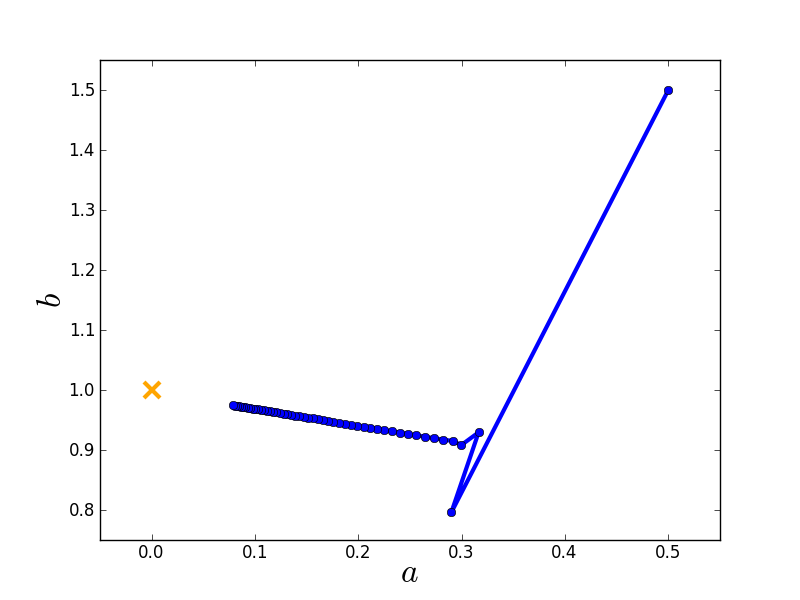
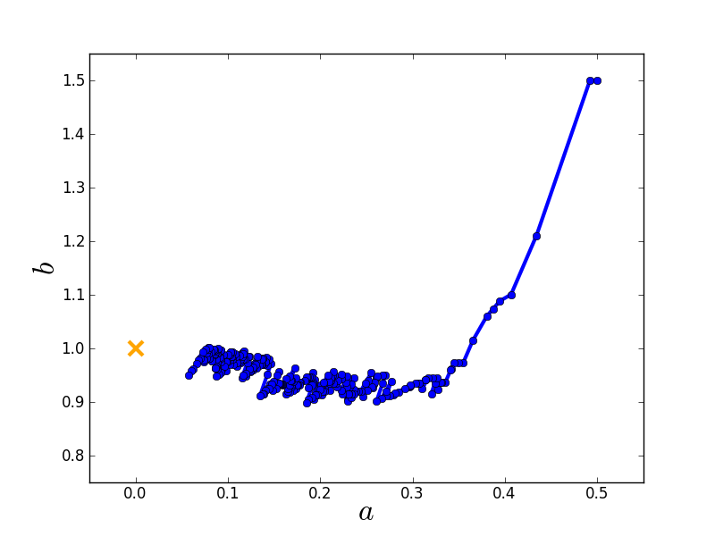

Gradient methods
========================

As mentioned before, `leastsq` and thus also `curve_fit` from `scipy.optimize` employ a Levenburg-Marquardt algorithm, which is a special kind of gradient method that is very popular in astronomy (e.g. used in GalFit). There are numerous different types of gradient methods, e.g.:

* Levenburg-Marquardt
* Newton's method
* conjugate gradient
* gradient ascent/descent
* stochastic gradient ascent/descent
* ...

Some of these methods are implemented in Scipy.

Convex optimisation
------------------

All gradient methods share the same implicit assumption: The objective function has a single global minimum. In other words, the likelihood function is ''convex''. More technical: A function is convex, if and only if its Hessian (matrix of second derivatives) has negative eigenvalues everywhere.

For linear models and Gaussian noise, this assumption is always satisfied, i.e., the likelihood is always convex. In this case, the Hessian is constant (independent of fit parameters) and all its eigenvalues are negative. This is clear because the Hessian is related to the covariance matrix via :math:`\Sigma=-H^{-1}` and :math:`\Sigma` is positive definite, so :math:`H` has to be negative definite.

As soon as models become nonlinear or data noise non-Gaussian, testing for convexity is often very difficult and rarely possible.

Moreover, nonlinear problems are often not convex, such that gradient methods all run into the nearest local minimum, depending on the initial guess. Therefore, gradient methods are highly efficient (fast) but not very robust, they have the ''opposite'' behaviour of the Simplex algorithm.

Unlike `leastsq` and `curve_fit`, gradient methods can also be applied to fit problems that do not have a least-squares formulation. However, this requires us to be able to implement them on our own!

Let us just talk about three simple examples.

Newton's method
---------------

Newton's method is actually a method for root finding. So we want to find the root of the first derivative of our objective function.

The algorithm is iterative, and given a parameter vector :math:`\theta_i`, the next iteration is obtain by

  :math:`\theta_{i+1} = \theta_i - H^{-1}\cdot\nabla_\theta J(\theta_i)`

Obviously, we need to compute the gradient :math:`\nabla_\theta J(\theta_i)` of our objective function :math:`J(\theta)` and the Hessian (matrix of second derivatives). This usually requires a lot of math.

In rare cases, the results are so simple that they can be easily implemented. If the assumption of a single global minimum holds (convex problem), then Newton's method will usually converge extremely fast (say within 5-10 iterations).

Gradient descent
-----------------

Gradient descent is an iterative algorithm, too. Let the objective function be :math:`\chi^2`, then the update equation is

  :math:`\theta_{i+1} = \theta_i - \alpha\nabla_\theta\chi^2 = \theta_i + 2\alpha\sum_{n=1}^N\frac{y_n-f(x_n)}{\sigma_n^2}\nabla_\theta f(x_n)`

The parameter :math:`\alpha` is sometimes called ''learning rate'', which is a fancy way of saying ''stepsize''.

Let us consider the following example::

  import matplotlib.pyplot as plt

  # Create toy data.
  xdata = [0.0,1.0,2.0,3.0,4.0,5.0]
  ydata = [0.1,0.9,2.2,2.8,3.9,5.1]
  sigma = [1.0,1.0,1.0,1.0,1.0,1.0]

  # Initial guess and learning rate.
  x0    = [0.5, 1.5]
  alpha = 0.01

  # Store initial guess for plotting.
  A = [x0[0]]
  B = [x0[1]]

  # Iteration.
  for i in range(50):
	  a = x0[0]
	  b = x0[1]
	  # Compute gradients of chi2 w.r.t. a and b.
	  grad_a = 0.0
	  grad_b = 0.0
	  for n in range(len(xdata)):
		  grad_a = grad_a - 2.0*(ydata[n] - a - b*xdata[n])*1.0/(sigma[n]*sigma[n])
		  grad_b = grad_b - 2.0*(ydata[n] - a - b*xdata[n])*xdata[n]/(sigma[n]*sigma[n])
	  # Update parameters.
	  a_new = a - alpha*grad_a
	  b_new = b - alpha*grad_b
	  x0    = [a_new,b_new]
	  
	  # Store parameters for plotting.
	  A.append(a_new)
	  B.append(b_new)

  # Plot route of gradient descent.
  plt.figure(1)
  plt.plot(A, B, 'o-', ms=6, lw=3, color='blue')
  plt.plot([0.0], [1.0], 'x', ms=12, markeredgewidth=3, color='orange')
  plt.xlim(-0.05,0.55)
  plt.ylim(0.75,1.55)
  plt.xlabel(r'$a$', fontsize=24)
  plt.ylabel(r'$b$', fontsize=24)
  plt.savefig('example-gradient-descent.png')
  plt.show()

Here is the route taken by the gradient descent algorithm towards the global minimum starting from an initial guess.

Stochastic gradient descent
-------------------

Gradient descent obviously tries to find the shortest path to the nearest local minimum. This strict behaviour can be relaxed by modifying the algorithm.

Gradient descent computes the gradient using all data. Conversely, stochastic gradient descent computes the gradient using only a single data point, which is chosen randomly (therefore ''stochastic''). This has two major advantages:

* The algorithm's route in parameter space is randomised, such that it has the chance not to end up in the nearest local minimum but to find some other minimum that is potentially better.
* If there is a lot of data, computing the gradient may be very costly. Stochastic gradient descent reduces this cost.

The code of gradient descent only needs to be modified slightly::

  import matplotlib.pyplot as plt
  import random as random

  # set random seed.
  random.seed(1)

  # Create toy data.
  xdata = [0.0,1.0,2.0,3.0,4.0,5.0]
  ydata = [0.1,0.9,2.2,2.8,3.9,5.1]
  sigma = [1.0,1.0,1.0,1.0,1.0,1.0]

  # Initial guess and learning rate (same as for gradient descent).
  x0    = [0.5, 1.5]
  alpha = 0.01

  # Store initial guess for plotting.
  A = [x0[0]]
  B = [x0[1]]

  # Iteration (same number of evaluations as for gradient descent).
  for i in range(300):
	  a = x0[0]
	  b = x0[1]
	  # Compute stochastic gradients of chi2 w.r.t. a and b.
	  n      = random.randint(0,len(xdata)-1)  # randomly chose data point
	  grad_a = - 2.0*(ydata[n] - a - b*xdata[n])*1.0/(sigma[n]*sigma[n])
	  grad_b = - 2.0*(ydata[n] - a - b*xdata[n])*xdata[n]/(sigma[n]*sigma[n])
	  # Update parameters.
	  a_new = a - alpha*grad_a
	  b_new = b - alpha*grad_b
	  x0    = [a_new,b_new]
	  
	  # Store parameters for plotting.
	  A.append(a_new)
	  B.append(b_new)

  # Plot route of gradient descent.
  plt.figure(1)
  plt.plot(A, B, 'o-', ms=6, lw=3, color='blue')
  plt.plot([0.0], [1.0], 'x', ms=12, markeredgewidth=3, color='orange')
  plt.xlim(-0.05,0.55)
  plt.ylim(0.75,1.55)
  plt.xlabel(r'$a$', fontsize=24)
  plt.ylabel(r'$b$', fontsize=24)
  plt.savefig('example-stochastic-gradient-descent.png')
  plt.show()

Here is the route taken by the stochastic gradient descent algorithm towards the global minimum starting from the same initial guess.

