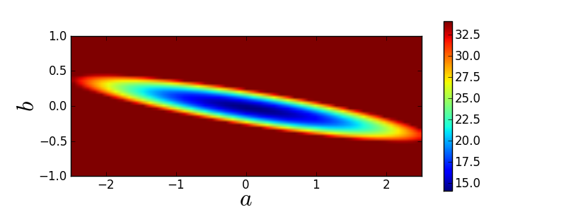

Introduction
=================

We are given:

* observational data
* a model with a set of fit parameters

Goal:

* Want to optimise some objective function.
* E.g.: Want to minimise squared difference between some model and some given data.

What we do not talk about:

* How to choose your objective function.
* How to choose your model.

Linear vs. non-linear models
----------------

A model :math:`f(x;\theta)` is called linear if and only if we can write it as :math:`f(x;\theta)=\theta^T\cdot x`. Examples for linear models are:

* :math:`f(x) = a + bx` (straight line)
* :math:`f(x) = a + bx+cx^2+dx^3`
* :math:`f(x) = a\cos(x)+b\sin(x)`

If the optimisation problem is a least-squares problem, fitting linear models can be done analytically using linear algebra (matrices)! In this case, the resulting likelihood is always exactly Gaussian (no approximation!), i.e., it is unimodal and there is a single global optimum (convex problem).

However, many interesting astrophysical problems are not linear! Examples for non-linear models are:

* :math:`f(x) = a\cos(b*x)`
* fitting emission/absorption features in a spectrum
* fitting light profiles of galaxies (morphology)

For nonlinear models or linear models without least-squares formulation, there is usually no analytic solution and the likelihood may also be multimodal. In this case, we need an optimisation algorithm in order to fit the model parameters.

First idea: Brute-force grids
---------------

Try brute-force all combinations of fit parameters and find the optimum of the objective function.

Let's create some toy data::
  
  import numpy
  import matplotlib.pyplot as plt

  # Create 1D Gaussian toy data.
  numpy.random.seed(1)  # set random seed
  # Draw 10 values from unit Gaussian.
  Data = numpy.random.normal(0.0, 1.0, 10)

Our model is a straight line with true parameters offset a = 0.0 and slope  b = 0.0. Fit for a and b using a brute-force grid::

  # Range of parameter a.
  a_min = -2.5
  a_max =  2.5
  # Range of parameter b.
  b_min = -1.0
  b_max =  1.0
  # Number of steps of grid.
  Steps = 51
  # Allocate grid as matrix.
  Grid  = numpy.zeros([Steps,Steps])
  # Try all parameter combinations.
  for s1 in range(Steps):
      for s2 in range(Steps):
          # Current parameter combination.
          a = a_min + (a_max - a_min)*float(s1)/float(Steps-1)
          b = b_min + (b_max - b_min)*float(s2)/float(Steps-1)
          
          # Evaluate chi-squared.
          chi2 = 0.0
          for n in range(len(Data)):
              # Use index n as pseudo-position
              residual = (Data[n] - a - n*b)
              chi2     = chi2 + residual*residual
          Grid[Steps-1-s2,s1] = chi2

  plt.figure(1, figsize=(8,3))
  mini  = numpy.min(Grid)  # minimal value of chi2
  image = plt.imshow(Grid, vmin=mini, vmax=mini+20.0, 
                           extent=[a_min,a_max,b_min,b_max])
  plt.colorbar(image)
  plt.xlabel(r'$a$', fontsize=24)
  plt.ylabel(r'$b$', fontsize=24)
  plt.savefig('example-chi2-manifold.png')
  plt.show()

Here is what the resulting :math:`\chi^2`-manifold looks like:

Brute-force grids may seem naive but this method is the first to consider!

Second idea: Random grids
----------------

Brute-force grids quickly become computationally infeasible for more than 1 or 2 fit parameters. Computation times increase exponentially.

Instead of using a regular grid, simply try random values of all parameters and finally take that one with best objective function.

However, if we have a lot of fit parameters, the chance that we hit a good parameter combination by pure luck decreases exponentially.

Consequently, we need to talk about more elaborate optimisation algorithms.

