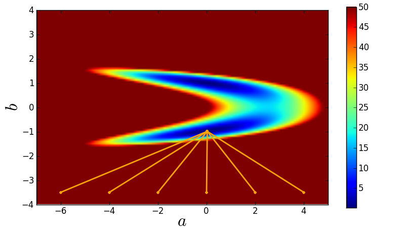

Least-squares fitting in Python
===============================

Many fitting problems (by far not all) can be expressed as least-squares problems.

What is least squares?
----------------

* Minimise :math:`\chi^2 = \sum_{n=1}^N \left(\frac{y_n - f(x_n)}{\sigma_n}\right)^2`
* If and only if the data's noise is Gaussian, minimising :math:`\chi^2` is identical to maximising the likelihood :math:`\mathcal L\propto e^{-\chi^2/2}`.
* If data's noise model is unknown, then minimise :math:`J = \sum_{n=1}^N \left(y_n - f(x_n)\right)^2`
* For non-Gaussian data noise, least squares is just a recipe (usually) without any probabilistic interpretation (no uncertainty estimates).

Least squares in Scipy I: `scipy.optimize.leastsq`
----------------

Scipy provides a method called `leastsq` as part of its `optimize` package. However, there are tow problems:

* This method is not well documented (no easy examples).
* The way the function for minimisation is provided seems to allow only for linear models.
* Error/covariance estimates on fit parameters not straight-forward to obtain.

Internally, `leastsq` uses Levenburg-Marquardt to minimise the score function.

First step is to declare the function that should be minimised::
  
  import numpy

  # The function whose square is to be minimised.
  # params ... list of parameters tuned to minimise function.
  # Further arguments:
  # xdata ... design matrix for a linear model.
  # ydata ... observed data.
  def func(params, xdata, ydata):
	  return (ydata - numpy.dot(xdata, params))

  # Generate artificial data = straight line with a=0 and b=1 plus some noise.
  xdata = numpy.transpose(numpy.array([[1.0,1.0,1.0,1.0,1.0,1.0],[0.0,1.0,2.0,3.0,4.0,5.0]]))
  ydata = numpy.array([0.1,0.9,2.2,2.8,3.9,5.1])
  # Initial guess.
  x0    = numpy.array([0.0, 0.0])

Now, we can use the least-squares method::

  import scipy.optimize as optimization

  print optimization.leastsq(func, x0, args=(xdata, ydata), maxfev=1000)

Note the `args` argument, which is necessary in order to pass the data to the function.

This only provides the parameter estimates (a=0.02857143, b=0.98857143).

Least squares in Scipy II: `scipy.optimize.curve_fit`
----------------

`curve_fit` is also part of `scipy.optimize` and a wrapper for `scipy.optimize.leastsq` that overcomes its poor usability.

For instance, the objective function is much more easily defined as the model::

  def func(x, a, b, c):
      return a + b*x + c*x*x

Furthermore, the input data does not need to be a design matrix anymore::
  
  xdata = numpy.array([0.0,1.0,2.0,3.0,4.0,5.0])
  # Initial guess.
  x0    = numpy.array([0.0, 0.0, 0.0])

Data errors can also easily be provided::
  
  sigma = numpy.array([1.0,1.0,1.0,1.0,1.0,1.0])

Usage is very simple::
  
  print optimization.curve_fit(func, xdata, ydata, x0, sigma)

This outputs the actual parameter estimate (a=0.1, b=0.88142857, c=0.02142857) and the 3x3 covariance matrix.

Lack of robustness
----------------

Gradient methods such as Levenburg-Marquardt used by `leastsq`/`curve_fit` simply run into the nearest local minimum.

Here is a demonstration::
  
  import numpy,math
  import scipy.optimize as optimization
  import matplotlib.pyplot as plt
  
  # Chose a model that will create bimodality.
  def func(x, a, b):
	  return a + b*b*x
  
  # Create toy data.
  xdata = numpy.array([0.0,1.0,2.0,3.0,4.0,5.0])
  ydata = numpy.array([0.1,0.9,2.2,2.8,3.9,5.1])
  sigma = numpy.array([1.0,1.0,1.0,1.0,1.0,1.0])
  
  # Compute chi-square manifold.
  Steps = 101
  Chi2Manifold = numpy.zeros([Steps,Steps])
  amin = -7.0
  amax = +5.0
  bmin = -4.0
  bmax = +4.0
  for s1 in range(Steps):
      for s2 in range(Steps):
	  a = amin + (amax - amin)*float(s1)/(Steps-1)
	  b = bmin + (bmax - bmin)*float(s2)/(Steps-1)
	  
	  chi2 = 0.0
	  for n in range(len(xdata)):
		  residual = (ydata[n] - func(xdata[n], a, b))/sigma[n]
		  chi2 = chi2 + residual*residual
	  Chi2Manifold[Steps-1-s2,s1] = chi2
  
  
  plt.figure(1, figsize=(8,4.5))
  plt.subplots_adjust(left=0.09, bottom=0.09, top=0.97, right=0.99)
  # Plot chi-square manifold.
  image = plt.imshow(Chi2Manifold, vmax=50.0, extent=[amin, amax, bmin, bmax])
  # Plot where curve-fit is going to for a couple of initial guesses.
  for a_initial in -6.0, -4.0, -2.0, 0.0, 2.0, 4.0:
	  # Initial guess.
	  x0   = numpy.array([a_initial, -3.5])
	  xFit = optimization.curve_fit(func, xdata, ydata, x0, sigma)[0]
	  plt.plot([x0[0], xFit[0]], [x0[1], xFit[1]], 'o-', ms=4, markeredgewidth=0, lw=2, color='orange')
  plt.colorbar(image)  # make colorbar
  plt.xlim(amin, amax)
  plt.ylim(bmin, bmax)
  plt.xlabel(r'$a$', fontsize=24)
  plt.ylabel(r'$b$', fontsize=24)
  plt.savefig('demo-robustness-curve-fit.png')
  plt.show()

