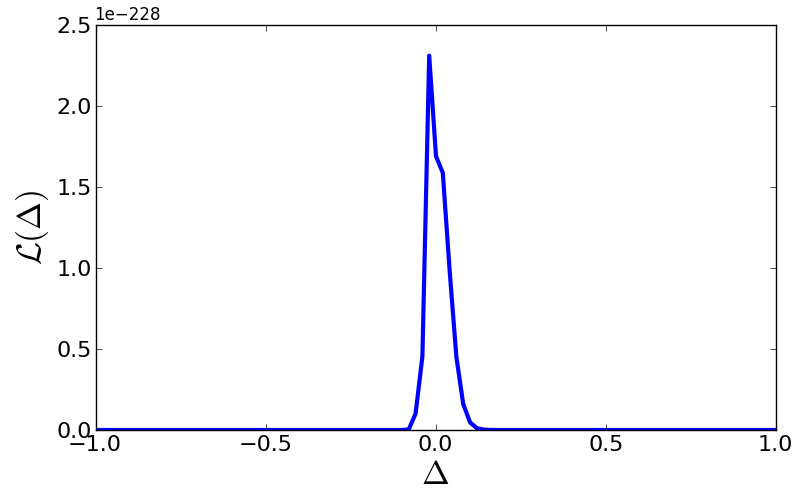

Example 1: Comparing population proportions
============================

Background
-------------------

The comparison of population proportions is a very common task in science. Here are three examples:

:Astronomy: Say you have two samples of galaxies, one sample being active galaxies, the other sample inactive galaxies. For both sets, you also counted the number of merging galaxies. You now want to know, whether the merger rate in active galaxies is larger than in inactive galaxies. (Common idea: Activity is triggered by merging.)

:Medicine: You test a new drug to cure some disease. You have two groups of test patients, one getting the real drug, the other getting a placebo. Now you want to compare the percentage of patients healed from the disease in both groups, thereby assessing the effect of your new drug.

:Biology: Somebody claimed that "beautiful" parents tend to have more girls than "normal" parents. So you need to compare the proportions of newborn girls vs. boys for "beautiful" parents and for "normal" parents.

The solution
-------------------

In order to solve these problems, we need a little bit of statistics, but not that much. We specialise on the astronomical problem here.

We need to compare two samples, so let us consider each sample individually first. For each sample, we have the number of merging galaxies and the total number of galaxies in that sample. In statistics speech, the number n of successes and the number N of trials. We then want to estimate the success rate p.

Common sense tells us that the success rate should be something like :math:`p=n/N`. The likelihood of p is given by the binomial likelihood :math:`\mathcal L\propto p^n(1-p)^{N-n}` and its maximum is indeed at n/N.

Now, we have two samples - active and inactive galaxies - and want to know the likelihood function of :math:`\Delta=p_A-p_I`. The key is to realise that various combinations of :math:`p_A` and :math:`p_I` can generate the same value of :math:`\Delta` such that we need to add all their likelihood

:math:`\mathcal L(\Delta) \propto\int p_B^{n_B}(1-p_B)^{N_B-n_B}(\Delta+p_B)^{N_A}(1-\Delta-p_B)^{N_A-n_A}dp_B`

We can now implement the general solution. Here, we also plug in numbers from a real publication by `Cisternas et al. (2011) <http://adsabs.harvard.edu/abs/2011ApJ...726...57C>`_::

  from scipy.integrate import quad
  import math,pylab

  nA = 18    # Number of merging active galaxies
  NA = 140   # Total number of active galaxies
  nB = 153   # Number of merging inactive galaxies
  NB = 1264  # Total number of inactive galaxies

  # Step 1: Define integrand of likelihood of Delta.
  def integrand(p_B, delta):
	# Likelihood of sample B.
	lik_B = math.pow(p_B, nB)*math.pow(1.0 - p_B, NB - nB)
	# Likelihood of sample A where pA = Delta + pB.
	lik_A = math.pow(delta + p_B, nA)*math.pow(1.0 - delta - p_B, NA - nA)
	return lik_A*lik_B

  # Step 2: Define integral with appropriate integration limits:
  def integrateLikelihood(delta):
	if (delta >= 0.0):
		return quad(integrand, 0.0, 1.0 - delta, args=(delta))[0]
	else:
		return quad(integrand, -delta, 1.0, args=(delta))[0]

  # Step 3: Compute data for plotting likelihood of Delta.
  D = []
  L = []
  for i in range(201):
	Delta = -1.0 + 2.0*float(i)/200.0
	lik   = integrateLikelihood(Delta)
	D.append(Delta)
	L.append(lik)

  # Step 4: Make plot
  fig = pylab.figure(1, figsize=(8,5))  # figure size 8x5
  fig.subplots_adjust(left=0.12, bottom=0.14, right=0.97, top=0.95)  # boundaries
  pylab.plot(D, L, '-', lw=3, color='blue')  # plot data
  pylab.xticks(fontsize=16)  # set fontsize of axis ticks
  pylab.yticks(fontsize=16)  # set fontsize of axis ticks
  pylab.xlabel(r'$\Delta$', fontsize=24)  # set axis label
  pylab.ylabel(r'$\cal L(\Delta)$', fontsize=24)  # set axis label
  pylab.savefig('prob-2-likelihood-delta.png')  # save figure
  pylab.show()

That is how the likelihood looks. Scientific inference accomplished. Well, not quite, as we cannot put such a figure into the abstract of a paper, wherefore we need to condense this likelihood function into some plain numbers.

We can also compute various diagnostics. Say we want to know the likelihood that :math:`p_A>p_B` or rather :math:`\Delta>0`. For this purpose, we only need to integrate :math:`\mathcal L(\Delta)` from 0 to +1 (and compute the normalisation constant)::

  # Step 5: Compute normalisation constant.
  normalisation = quad(integrateLikelihood, -1.0, 1.0)[0]
  print quad(integrateLikelihood, 0.0, 1.0)[0]/normalisation

We find a chance of only 51.9% that :math:`\Delta` is positive, i.e., that the merger rate in active galaxies is larger than in inactive galaxies (irrespective of what the precise merger rates are in each set).

Revisiting the other two examples
-------------------------------

You now have the code to also tackle the other two examples. All you need to do is to change the number statistics in the code:

:Biology: `Gelman & Weakliem (2009) <http://www.stat.columbia.edu/~gelman/research/unpublished/power.pdf>`_ determined that the 50 most beautiful people of 1995 had 32 daughters and 24 sons. As a comparison sample, we can use Germany's birth statistics, where in 100 births there are 48.7 girls. Do we find convincing evidence that beautiful people indeed have more daughters?

:Medicine: The astronomical example was interesting, the biological example was entertaining. Now, the medicine example can decide about life or death - or at least about the health of a real human being. In the textbook(!) by Schulz et al. (2002), "Phytopharmaka VII", p. 85, we find the following example: A. Biller investigates a new drug to cure Coxarthrosis. His test sample are 21 patients of which 15 are cured. His reference set are 20 patients that get placebos whereof 8 are cured. He claims to find a statistically significant difference based on a p-value of 0.041. Are we convinced?