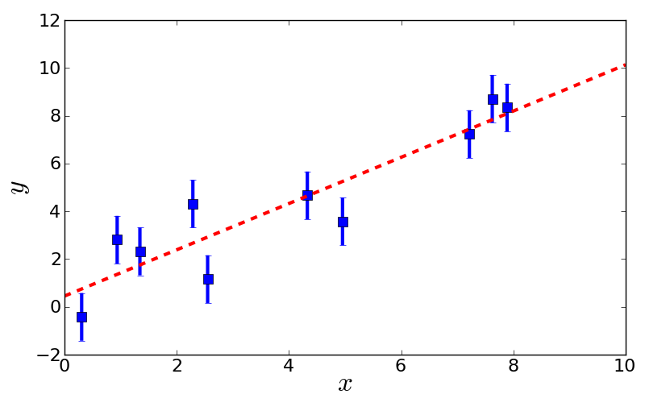

Example 2: Fitting linear models with Numpy
===================================

Background
-------------------

Analysing scientific data often requires fitting models. Such models virtually always contain linear fit parameters - and often also nonlinear fit parameters. The crucial point is that fitting linear parameters can be done analytically, which improves both accuracy and speed.

For the sake of simplicity, we only consider purely linear models here, where the fit is wholly analytic. The analytic fit requires some linear algebra, where Numpy can help us.

Say we have a model of the form of a polynomial :math:`f(x)=a_0+a_1 x+a_2 x^2+a_3 x^3+\ldots` and we want to minimise :math:`\chi^2=\sum_{n=1}^N\left(\frac{y_n - f(x_n)}{\sigma_n}\right)^2`.

It is now clever to rewrite chi-square in terms of matrices and vectors :math:`\chi^2 = (\vec y - X\cdot\vec a)^T\cdot\Sigma^{-1}\cdot(\vec y - X\cdot\vec a)` where:

* :math:`\vec y=(y_1,y_2,\ldots,y_N)` is the vector of N measurements.
* X is the design matrix with elements :math:`X_{np}=x_n^p`.
* :math:`\vec a=(a_0,a_1,\ldots,a_P)` is the vector of linear fit parameters.
* :math:`\Sigma` is the covariance matrix, in our case the diagonal matrix :math:`\Sigma_{nn}=\sigma_n^2`.

Using this notation, the best-fit amplitudes are given by :math:`\vec a=(X^T\cdot\Sigma^{-1}\cdot X)^{-1}\cdot X^T\cdot\Sigma^{-1}\cdot\vec y`.

This may look complicated at first glance, but it is simple enough to type into a Numpy code.

Generating artificial toy data
--------------------------

Let us write a simple piece of code which generates some toy data that we can use for demonstrations later.

We want a python script called "ToyDataGeneration.py" that provides a method "generateToyData" that generates data from some underlying polynomial function and adds some Gaussian noise. Here we go::
  
  import math
  import random as random
  
  # Generate toy data from polynomial function.
  # Inputs: amplitudes ... Numpy array of amplitudes. Its length specifies polynomial order.
  #         sigma      ... Gaussian noise level. Identical for all data points.
  #         N          ... Number of data points sampled.
  #         xrange     ... x-range where data points are sampled from.
  #         seed       ... random seed to ensure reproducability.
  def generateToyData(amplitudes, sigma, N, xrange, seed):
	random.seed(seed)
	X = []  # prepare array for x coordinates
	Y = []  # prepare array for y coordinates
	for n in range(N):
		# First, draw an x coordinate from given range.
		x = random.uniform(xrange[0],xrange[1])
		# Second, compute y from given polynomial amplitudes.
		y = 0.0
		for p in range(len(amplitudes)):
			y = y + amplitudes[p]*math.pow(x, p)
		# Third, add Gaussian noise.
		y = y + random.gauss(0.0, sigma)
		# Finally, append to arrays.
		X.append(x)
		Y.append(y)
	return [X,Y]

Fitting a linear model analytically
------------------------

Let us now fit a linear model to see Numpy's linear algebra in action. We use a straight line with offset 0 and slope 1. Here is the code::

  import ToyDataGeneration
  import pylab,numpy

  # Step 1: Generate toy data from straight line a_0=0 and a_1=1.
  N     = 10
  [X,Y] = ToyDataGeneration.generateToyData([0.0,1.0], 1.0, N, [0.0,10.0], 1)

  # Step 2: Compute design matrix. Covariance matrix is identity matrix and drops out.
  Design = numpy.zeros([N,2])
  for n in range(N):
	  Design[n,0] = 1.0   # x^0
	  Design[n,1] = X[n]  # x^1

  # Step 3: Compute analytic fit.
  Dt  = numpy.transpose(Design)  # Transpose of Design appears twice, but compute only once.
  DtD = numpy.dot(Dt,Design)     # For brevity, compute Dt*D here.
  # Now, compute best-fit amplitudes.
  [a0,a1] = numpy.dot(numpy.linalg.inv(DtD),numpy.dot(numpy.transpose(Design), Y))
  # Print best-fit amplitues
  print a0
  print a1
  # Compute chi-square.
  residuals = Y - numpy.dot(Design,[a0,a1])
  chi2      = numpy.dot(residuals,residuals)
  print chi2

  # Step 4: Make plot.
  fig = pylab.figure(1, figsize=(8,5))  # figure size 8x5
  fig.subplots_adjust(left=0.1, bottom=0.12, right=0.97, top=0.95)  # boundaries
  for n in range(N):
	  pylab.errorbar(X[n], Y[n], yerr=1.0, lw=3, color='blue')  # plot errorbars
  pylab.plot(X, Y, 's', ms=8, color='blue')  # plot data
  pylab.plot([0.0, 10.0], [a0, a0 + a1*10.0], '--', lw=3, color='red')  # plot fit
  pylab.xticks(fontsize=16)  # set fontsize of axis ticks
  pylab.yticks(fontsize=16)  # set fontsize of axis ticks
  pylab.xlabel(r'$x$', fontsize=24)  # set axis label
  pylab.ylabel(r'$y$', fontsize=24)  # set axis label
  pylab.savefig('prob-3-linear-fit.png')  # save figure
  pylab.show()

