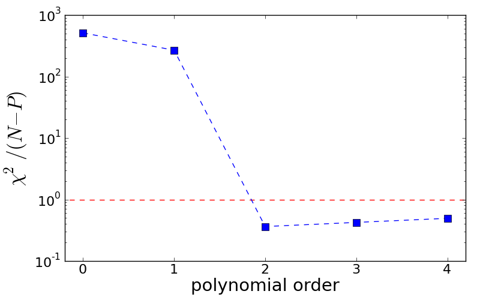
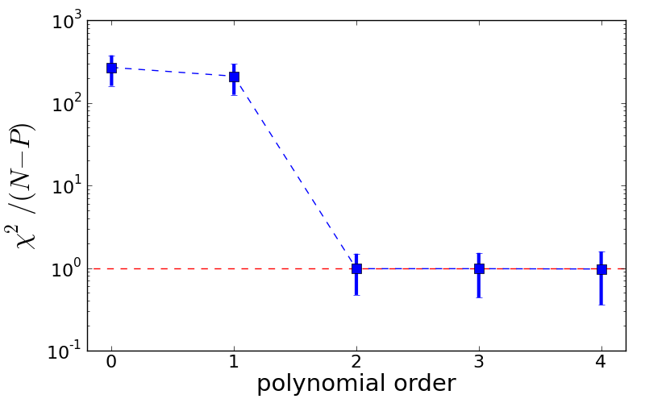
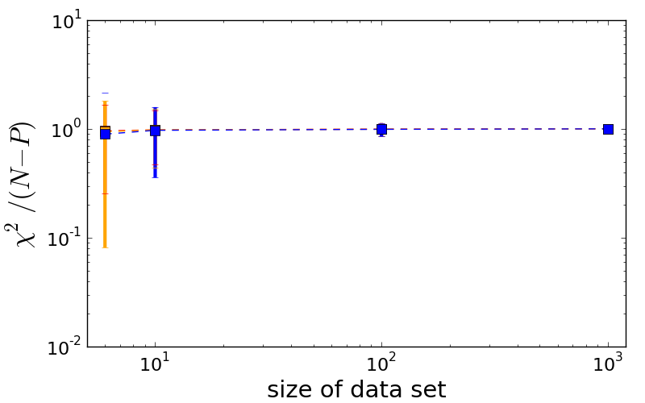

Example 3: Pitfalls of model comparison
===============================

Background
-------------------

Model comparison is a common task in science. Say you have radial-velocity measurements of a star and you want to know whether this star hosts one or more exoplanets. So you fit models with varying numbers of exoplanets to your data and then you need to assess which model fits your data best.

The standard approach in astronomy is to employ reduced :math:`\chi^2`, where you devide :math:`\chi^2` by the number of degrees of freedom. The best model has a reduced :math:`\chi^2` closest to unity. Alternatively, astronomers usually conduct :math:`\chi^2`-tests, KS-tests or - in the case of exoplanets - false-alarm probabilities, which provide p-values.

Unfortunately, p-values suffer from a systematic effect that essentially undermines their credibility, as we will learn in this example.

What is the right polynomial order?
-------------------

Let us start easy by using our previous code to simulate some data from a 2nd-order polynomial. We then pretend that we do not know that the polynomial was of 2nd order and try to estimate the polynomial order from the data using reduced :math:`\chi^2`. Here is the code::

  import ToyDataGeneration
  import pylab,numpy,math

  # Step 1: Define method that conducts analytic fit and returns reduced chi2.
  #         (We need to call this multiple times and don't want to repeat the code everytime.
  # Input:  X ... x-coordinates.
  #         Y ... y-coordinates.
  #         O ... maximum order of polynomial that is fitted to the data.
  def computeReducedChi2(X, Y, O):
	  P      = O + 1   # Number of amplitudes = order + 1
	  N      = len(X)  # Number of data points.
	  Design = numpy.zeros([N,P])
	  for n in range(N):
	      for p in range(P):
		  Design[n,p] = math.pow(X[n], p)   # x_n^p
	  
	  # Compute analytic fit.
	  Dt  = numpy.transpose(Design)  # Transpose of Design appears twice, but compute only once.
	  DtD = numpy.dot(Dt,Design)     # For brevity, compute Dt*D here.
	  # Now, compute best-fit amplitudes.
	  amplitudes = numpy.dot(numpy.linalg.inv(DtD),numpy.dot(numpy.transpose(Design), Y))
	  # Compute chi-square.
	  residuals = Y - numpy.dot(Design, amplitudes)
	  chi2      = numpy.dot(residuals,residuals)
	  # Degrees of freedom is N-P.
	  print str(O)+"\t"+str(chi2/float(N-P))  # print order and reduced chi-square
	  return chi2/float(N-P)

  # Step 2: Generate toy data from 2nd order polynomial a_0=0 and a_1=1 and a_2=0.5.
  N     = 10
  [X,Y] = ToyDataGeneration.generateToyData([0.0,1.0,0.5], 1.0, N, [-10.0,10.0], 2)

  # Step 3: Evaluate reduced chi-squared for models of various polynomial orders.
  Order   = []
  RedChi2 = []
  for order in 0,1,2,3,4:
	  Order.append(order)
	  RedChi2.append(computeReducedChi2(X, Y, order))

  # Step 4: Make plot.
  fig = pylab.figure(1, figsize=(8,5))  # figure size 8x5
  fig.subplots_adjust(left=0.135, bottom=0.13, right=0.97, top=0.95)  # boundaries
  pylab.plot([-1,6], [1,1], '--', lw=1, color='red')  # plot data
  pylab.plot(Order, RedChi2, 's--', ms=8, lw=1, color='blue')  # plot data
  pylab.yscale('log')        # y-axis in log scale
  pylab.xlim(-0.2,4.2)
  pylab.xticks(fontsize=16)  # set fontsize of axis ticks
  pylab.yticks(fontsize=16)  # set fontsize of axis ticks
  pylab.xlabel('polynomial order', fontsize=21)  # set axis label
  pylab.ylabel(r'$\chi^2/(N-P)$', fontsize=24)  # set axis label
  pylab.savefig('prob-3-infer_polynomial_order_simple.png')  # save figure
  pylab.show()

Now, we see that reduced :math:`\chi^2` actually favours a polynomial of order 4, although the data actually came from a polynomial of 2nd order.

Impact of noise
-------------------

The fact that in the previous example reduced :math:`\chi^2` favoured an incorrect solution can be interpreted as a consequence of the data being noisy. So far so good.

Then, let us use multiple noise realisations of the data and average reduced :math:`\chi^2` over all these realisations. This should rule out the impact of noise. We simply continue the previous code::

  # Step 5: Draw multiple samples of data sets and average reduced chi2.
  S          = 100  # Number of samplings.
  Order      = []
  RedChi2    = []
  RedChi2Err = []
  for order in 0,1,2,3,4:
	  Order.append(order)
	  R = []
	  for s in range(S):
		  seed  = 2+s*N  # need to adjust random seed to generate different data
		  [X,Y] = ToyDataGeneration.generateToyData([0.0,1.0,0.5], 1.0, N, [-10.0,10.0], seed)
		  R.append(computeReducedChi2(X, Y, order))
	  RedChi2.append(numpy.mean(R))
	  RedChi2Err.append(numpy.std(R))
	  print str(order)+"\t"+str(numpy.mean(R))+" +/- "+str(numpy.std(R))

  # Step 6: Make plot.
  fig = pylab.figure(2, figsize=(8,5))  # figure size 8x5
  fig.subplots_adjust(left=0.135, bottom=0.13, right=0.97, top=0.95)  # boundaries
  pylab.plot([-1,6], [1,1], '--', lw=1, color='red')  # plot data
  for o in range(len(Order)):
	  pylab.errorbar(Order[o], RedChi2[o], yerr=RedChi2Err[o], lw=3, color='blue')
  pylab.plot(Order, RedChi2, 's--', ms=8, lw=1, color='blue')  # plot data
  pylab.yscale('log')        # y-axis in log scale
  pylab.xlim(-0.2,4.2)
  pylab.xticks(fontsize=16)  # set fontsize of axis ticks
  pylab.yticks(fontsize=16)  # set fontsize of axis ticks
  pylab.xlabel('polynomial order', fontsize=21)  # set axis label
  pylab.ylabel(r'$\chi^2/(N-P)$', fontsize=24)  # set axis label
  pylab.savefig('prob-3-infer_polynomial_order_advanced.png')  # save figure
  pylab.show()

Obviously, that did not help us to solve this problem. What is going on here?

The pitfal: More data does not help!
-----------------------------

Let us investigate, how the results of reduced :math:`\chi^2` change if we vary the size of the data set. We already have all necessary components and can simply continue the previous code::

  # Step 7: Increase sample size and monitor evolution of reduced chi-square.
  SampleSize     = []
  RedChi2_O2     = []
  RedChi2_O2_Err = []
  RedChi2_O3     = []
  RedChi2_O3_Err = []
  RedChi2_O4     = []
  RedChi2_O4_Err = []
  for N in 6,10,100,1000:
	  SampleSize.append(N)
	  R2 = []
	  R3 = []
	  R4 = []
	  for s in range(S):
		  [X,Y] = ToyDataGeneration.generateToyData([0.0,1.0,0.5], 1.0, N, [-10.0,10.0], 2+s*N)
		  R2.append(computeReducedChi2(X, Y, 2))
		  R3.append(computeReducedChi2(X, Y, 3))
		  R4.append(computeReducedChi2(X, Y, 4))
	  RedChi2_O2.append(numpy.mean(R2))
	  RedChi2_O3.append(numpy.mean(R3))
	  RedChi2_O4.append(numpy.mean(R4))
	  RedChi2_O2_Err.append(numpy.std(R2))
	  RedChi2_O3_Err.append(numpy.std(R3))
	  RedChi2_O4_Err.append(numpy.std(R4))

  # Step 8: Make plot.
  fig = pylab.figure(3, figsize=(8,5))  # figure size 8x5
  fig.subplots_adjust(left=0.135, bottom=0.14, right=0.97, top=0.95)  # boundaries
  for s in range(len(SampleSize)):
	  pylab.errorbar(SampleSize[s], RedChi2_O2[s], yerr=RedChi2_O2_Err[s], lw=3, color='red')
	  pylab.errorbar(SampleSize[s], RedChi2_O3[s], yerr=RedChi2_O3_Err[s], lw=3, color='orange')
	  pylab.errorbar(SampleSize[s], RedChi2_O4[s], yerr=RedChi2_O4_Err[s], lw=3, color='blue')
  pylab.plot(SampleSize, RedChi2_O2, 's--', ms=8, lw=1, color='red')  # plot data
  pylab.plot(SampleSize, RedChi2_O3, 's--', ms=8, lw=1, color='orange')  # plot data
  pylab.plot(SampleSize, RedChi2_O4, 's--', ms=8, lw=1, color='blue')  # plot data
  pylab.xscale('log')        # x-axis in log scale
  pylab.yscale('log')        # y-axis in log scale
  pylab.xlim(5,1200)
  pylab.xticks(fontsize=16)  # set fontsize of axis ticks
  pylab.yticks(fontsize=16)  # set fontsize of axis ticks
  pylab.xlabel('size of data set', fontsize=21)  # set axis label
  pylab.ylabel(r'$\chi^2/(N-P)$', fontsize=24)  # set axis label
  pylab.savefig('prob-3-impact-data-size.png')  # save figure
  pylab.show()

We now see that for polynomial orders 2, 3 and 4 the mean value of reduced :math:`\chi^2` does not change with size of data set. Let us spell this out explicitly:

**More data does not help!**

For p-values, the situation is even worse. If one increases the data set there, they start to systematically favour complex models over simple models - irrespective of which model is better.

Let us exploit this simple fact with a thought experiment: Again, we are given various radial-velocity observations of a single star and want to estimate the number of exoplanets hosted by this star. Our initial data comprises, say, 240 RV measurements, and reduced :math:`\chi^2` and/or some p-value tells us, there are 6 exoplanets. Now we want to improve our results by adding more data, say we double the number of RV measurements. What will happen? If we use p-values, the number of exoplanets will increase, since p-values favour complex models over simple models. In the limit of us acquiring infinite RV measurements, the number of exoplanets will not converge but increase without limit.

**Beware: This is exactly what is currently going on with Gliese 581!** See `here <http://adsabs.harvard.edu/abs/2010ApJ...723..954V>`_ for a typical example.