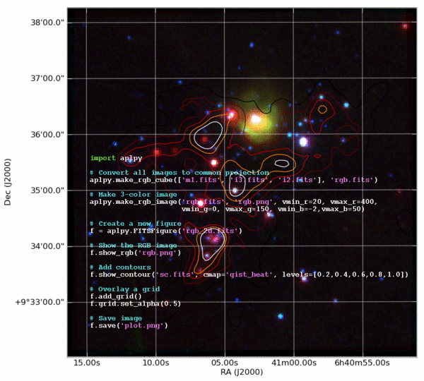

Introduction and Motivation
=============================================================

.. Make aplpy.gif with:
   convert -delay 700 aplpy.png -delay 300 aplpy_plain.png -loop 0 aplpy.gif

The MPIA Python course is a series of hands-on workshops to explore the Python
language and the powerful analysis tools it provides. *The emphasis is on
using Python to solve real-world problems that astronomers are likely to
encounter in research.*

This will be a hands-on experience largely focused on interactive data
analysis using tutorial examples that you type or cut-n-paste into the Python
interpreter. Participants should bring a laptop to each session or partner-up
with someone who has a laptop.

**Agenda**

The purpose of this section is to motivate astronomers to learn Python and
start using it as a tool for research and analysis.

.. toctree::
   :maxdepth: 1

   why-python
   quick-tour
   who-python
   wrapup

:Author: Originally written by Tom Aldcroft
:Copyright: 2011 Smithsonian Astrophysical Observatory
