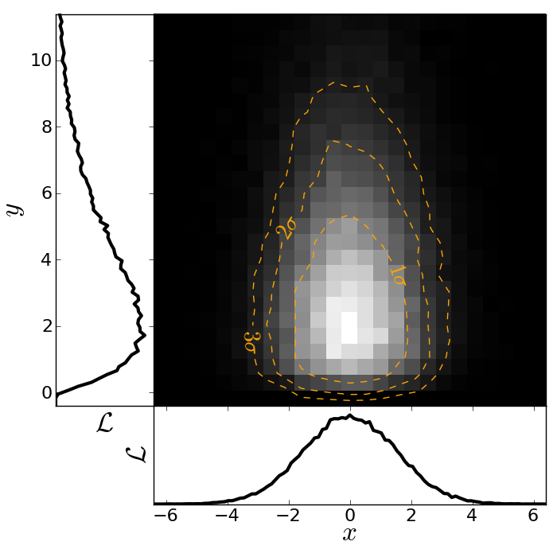

.. _quick tour:

Quick tour of Python
====================

In the spirit of this workshop let's jump in to real Python analysis code.

Making a publication quality image
----------------------------------

Making a publication quality image is a snap in Python using the `APLpy
<http://aplpy.github.com>`_ package (the Astronomical Plotting Library in Python).  Images can be made interactively or (reproducibly) with a script. Let's use this in combination with `ATpy <http://atpy.github.com>`_ (Astronomical Tables in Python) to make a plot of a region with contours and a catalog overlaid.

::

    import numpy as np
    import aplpy
    import atpy

    # Create a new figure
    fig = aplpy.FITSFigure('i3.fits')

    # Show the colorscale
    fig.show_colorscale()

    # Add contours
    fig.show_contour('sc.fits', cmap='jet', levels=np.linspace(0.0, 1.0, 10))

    # Make ticks white
    fig.ticks.set_color('white')

    # Make labels smaller and serif
    fig.tick_labels.set_font(size='small')

    # Overlay a grid
    fig.add_grid()
    fig.grid.set_alpha(0.5)

    # Add a colorbar
    fig.add_colorbar()

    # Use ATpy to read in an IRSA table
    tab = atpy.Table('2mass.tbl')
    tab_bright = tab.where(tab['j_m'] < 13.)

    # Plot markers
    fig.show_markers(tab['ra'], tab['dec'], marker='+', edgecolor='white')
    fig.show_markers(tab_bright['ra'], tab_bright['dec'], marker='o', edgecolor='white')

    # Save image for publication
    fig.save('aplpy_plot.png')

This produces the nice image:

We can also easily make 3-color images with FITS files that have different projections::

    import numpy as np
    import aplpy

    # Convert all images to common projection
    aplpy.make_rgb_cube(['m1.fits', 'i3.fits', 'i2.fits'], 'rgb.fits')

    # Make 3-color image
    aplpy.make_rgb_image('rgb.fits', 'rgb.png',
                         vmin_r=20, vmax_r=400,
                         vmin_g=0, vmax_g=150,
                         vmin_b=-2,vmax_b=50,
                         embed_avm_tags=True)

    # Make a plot similarly to before
    fig = aplpy.FITSFigure('rgb.png')
    fig.show_rgb()
    fig.show_contour('sc.fits', cmap='jet', levels=np.linspace(0.0, 1.0, 10))
    fig.ticks.set_color('white')
    fig.tick_labels.set_font(size='small')
    fig.add_grid()
    fig.grid.set_alpha(0.5)
    fig.save('aplpy_rgb_plot.png')

Which produces the following:

.. image:: aplpy_rgb_plot.png
   :scale: 60%

The Basics
----------

Here is a brief guide to the basics of python syntax.
Defining variables::

    a=1
    name="Jorge"

Python figures out the variable type for you.

Define functions
::

    def hello(name="John"):
        print "Hello, "+name

    def list_hello(names=["Tom", "Dick", "Harry"]):
        for name in names:
            print "Hello, "+name

":" indicates the beginning of something.  Indentation (4 spaces) tells python
which code is included in the code segment instead of `{` and `}`.

Functions in python can take both mandatory arguments and optional
keyword arguments. You can set default arguments for keywords.

It is easy to loop through elements of a `list` using a `for` loop.

Run the functions by inside python typing
::

>>> hello()
>>> list_hello()

Run a script file in `ipython` using the `run` command::

    In [1]: run myfile.py
    In [2]: a
    Out[2]: 1

    In [3]: name
    Out[3]: 'Jorge'

The variables you define in the script file are still available to you.::

    In [4]: hello
    Out[4]: <function hello at 0x1cec8c0>

Whoops.  A function needs to be called with `()`.  Otherwise, python just
tells you that it is a function::

    In [5]: hello()
    Hello, John

I can also set the keyword explicitly::

    In [6]: hello(name="Bryan")
    Hello, Bryan

or be lazy and just pass in the argument alone and python will assign it to
the keyword in the corresponding position::

    In [7]: hello("Dieter")
    Hello, Dieter

My list example also works::

    In [8]: list_hello()
    Hello, Tom
    Hello, Dick
    Hello, Harry

Array indexing
--------------

Numpy array indexing and multidimensional arrays::

  import scipy
  import numpy as np
  from numpy import random
  import matplotlib.pyplot as plt
  import asciitable

  # Create a simple numerical numpy 1D array (a vector, if you like):
  x = np.arange(10)
  print x
   	
  # To index a single element in x:
  print 'the first element of x is {0}' .format(x[0])
  print 'the second element of x is {0}' .format(x[1])

  # Selecting ranges with the :
  print 'to select the first 4 elements of x type x[0:4] or simply x[:4]= {0}' .format(x[0:4])

  # Indexing in steps
  print 'pick every other element of x by typing x[: :2] = {0}'.format(x[: : 2])

  # Negative indexing: start counting from the end
  print 'The last element of x can be indexed as x[-1] = {0}'.format(x[-1])
  print 'The last-but-one element of x can be indexed as x[-2] = {0}'.format(x[-2])

  # Negative indexing can also be used to select ranges, as above:
  print 'The last 4 elements of x are picked with x[-4:] = {0}'.format(x[-4:])
  print 'Negative indexing and stepsizes can be used to reverse an array! try e.g. x[: :-1] = {0}'.format(x[: : -1])

  # Now let's create a more typical array, with 2 dimensions, with numpy's random number generator:
  x2 = np.floor(10.*np.random.random((3,4)))
  print x2

  # Indexing a 2D array is much the same as for a 1D array.... The : indicates "all elements from this axis"
  print 'Element (1,1) of x2 is selected by x2[0,0] = {0}'.format(x2[0,0])
  print 'The first row of x2 is selected by x2[0,:] = {0}'.format(x2[0,:])
  print 'The 3rd column of x2 is selected by x2[:,2] = {0}'.format(x2[:,2])

  # We can also create more multi-dimensional arrays. This is a 4D array:
  x4 = np.floor(10.*np.random.random((2,3,4,2)))
  print x4

  # In principle indexing an N-dimensional array is again similar to previous examples....
  print 'The (0,0,0,0) element of x4 is selected by x4[0,0,0,0] = {0}'.format(x4[0,0,0,0])
  print 'To select just from one axis and include all elements from the other axes, use ..., e.g. x4[1,...] = \n{0}'.format(x4[1,...])

Reading text files and plotting
-------------------------------

Plot the space and redshift distribution of luminous red galaxies
(LRGs) from the 2SLAQ survey. The catalogue is available here:
http://www.2slaq.info/2SLAQ_LRG_v5pub.cat. First we'll read the
required columns from this text file and plot the galaxy distribution
in a thin declination slice, showing the galaxy brightness by the
point size, and colouring points by the r-i colour::

  import numpy as np
  import matplotlib.pyplot as plt
  from scipy import integrate
  from math import sqrt

  # To plot the space distribution we need to convert redshift to
  # distance.  The values and function below are needed for this
  # conversion.
  omega_m = 0.3
  omega_lam = 0.7
  H0 = 70.    # Hubble parameter at z=0, km/s/Mpc
  c_kms = 299792.458 # speed of light, km/s
  dH = c_kms / H0	   # Hubble distance, Mpc

  def inv_efunc(z):
      """ Used to calculate the comoving distance to object at redshift
      z. Eqn 14 from Hogg, astro-ph/9905116."""
      return 1. / sqrt(omega_m * (1. + z)**3 + omega_lam)

  # Now read the LRG positions, magnitudes and redshifts and r-i colours.
  r = np.genfromtxt('2SLAQ_LRG_v5pub.cat', dtype=None, skip_header=176,
   		    names='name,z,rmag,RA,Dec,rmi',	
                    usecols=(0, 12, 26, 27, 28, 32))

  # Only keep objects with a redshift larger than 0.1 and in a narrow
  # declination slice around the celestial equator
  condition = (np.abs(r['Dec']) < 0.2) & (r['z'] > 0.1)
  r = r[condition]

  # Calculate the comoving distance corresponding to each object's redshift
  dist = np.array([dH * integrate.quad(inv_efunc, 0, z)[0] for z in r['z']])

  # Plot the distribution of LRGs, converting redshifts to positions
  # assuming Hubble flow.
  theta = r['RA'] * np.pi / 180  # radians
  x = dist * np.cos(theta)
  y = dist * np.sin(theta)

  # Make the area of each circle representing an LRG position
  # proportional to its apparent r-band luminosity.
  sizes = 30 * 10**-((r['rmag'] - np.median(r['rmag']))/ 2.5)
  fig = plt.figure()
  ax = fig.add_subplot(111)

  # Plot the LRGs, colouring points by r-i colour.
  col = plt.scatter(x, y, marker='.', s=sizes, c=r['rmi'], linewidths=0.3,
                    cmap=plt.cm.Spectral_r)

  # Add a colourbar.
  cax = fig.colorbar(col)
  cax.set_label('r-i')

  plt.xlabel('Comoving Mpc')
  plt.ylabel('Comoving Mpc')
  plt.axis('equal')

This produces the image:

.. image:: dist_Mpc.png
   :scale: 60%

Now we'll plot a histogram of the redshift distribution. This
example demonstrates plotting two scales on the same axis -- redshift
along the bottom of the plot, corresponding distance along the top::

  zbins = np.arange(0.25, 0.9, 0.05)
  fig = plt.figure()
  ax = fig.add_subplot(111)
  plt.hist(r['z'], bins=zbins)
  plt.xlabel('LRG redshift')

  # Make a second axis to plot the comoving distance
  ax1 = plt.twiny(ax)

  # Generate redshifts corresponding to distance tick positions;
  # first get a curve giving Mpc as a function of redshift
  redshifts = np.linspace(0, 2., 1000)
  dist = [dH * integrate.quad(inv_efunc, 0, z)[0] for z in redshifts]
  Mpcvals = np.arange(0, 4000, 500)

  # Then interpolate to the redshift values at which we want ticks.
  Mpcticks = np.interp(Mpcvals, dist, redshifts)
  ax1.set_xticks(Mpcticks)
  ax1.set_xticklabels([str(v) for v in Mpcvals])

  # Make both axes have the same start and end point.
  x0,x1 = ax.get_xlim()
  ax1.set_xlim(x0, x1)
  ax1.set_xlabel('Comoving distance (Mpc)')

  plt.show()

.. image:: hist_z.png
   :scale: 60%

Making a fancy plot from Monte-Carlo samples
--------------------------------------------

Assume you have run an MCMC and you are left with two arrays X,Y of MCMC samples of two fit parameters. You now want to use X,Y to visualise the likelihood manifold. You can do that (a) as a simple scatter plot or (b) in a more fancy way.

Instead of Monte-Carlo samples, you could also be faced with distributions of any two parameters, such as effective temperature and surface gravity of a set of stars, or redshift and magnitude of a set of galaxies.

First, let us create some artificial toy data to mimick the output of an MCMC algorithm in some science application::

  import numpy,math
  import matplotlib.pyplot as plt
  import matplotlib.gridspec as gridspec

  # Create artificial data mimicking some MCMC results.
  N = 50000
  X = numpy.random.normal(0.0, 1.5, N)  # Draw N samples from normal distribution
  Y = numpy.random.gamma(2.0, 2.0, N)   # Draw N samples from Gamma distribution

Second, let us create a simple plot by plainly plotting x vs. y. This is very easy and we can recap some of the basic Python plotting commands::

  # Define plot ranges at beginning, since used often later.
  YRANGE = [-0.4,11.4]
  XRANGE = [-6.4,6.4]

  # Define figure size and formatting
  fig = plt.figure(1, figsize=(7,7))
  fig.subplots_adjust(left=0.10, bottom=0.09, top=0.98, right=0.98)

  # Simply plot X vs. Y as data points.
  plt.plot(X, Y, 'o', ms=4, alpha=0.1, color='blue')

  # Set plot ranges, axes ticks and axes labels.
  plt.xlim(XRANGE)                 # Set x plot range.
  plt.ylim(YRANGE)                 # Set y plot range.
  plt.xticks(fontsize=16)          # Set ticks x axis.
  plt.yticks(fontsize=16)          # Set ticks y axis.
  plt.xlabel(r'$x$', fontsize=24)  # Set label x axis.
  plt.ylabel(r'$y$', fontsize=24)  # Set label y axis.

  plt.savefig('plot_MCMC_samples_plain.png') # Save png file.

The result looks like this:

.. image:: plot_MCMC_samples_plain.png
     :height: 350px
     :width:  350px

Now, we would like to make this plot a little fancier. Our wish list is:

- We would like to see the density in the crowded regions!
- smoothed distribution instead of single points
- contours of confidence levels
- projected distributions of both parameters as side panels

The result should look like this:

Here is the code showing how to do this. We start by the top right panel, which is the main panel::

  fig = plt.figure(2, figsize=(7,7))
  fig.subplots_adjust(hspace=0.001, wspace=0.001, left=0.10, bottom=0.095, top=0.975, right=0.98)
  # gridspec enables you to assign different formats to panels in one plot.
  gs = gridspec.GridSpec(2, 2, width_ratios=[1,4], height_ratios=[4,1])

  plt.subplot(gs[1]) # Main panel top right contains full 2D histogram.
  # Convert to 2d histogram.
  Bins = 25
  hist2D, xedges, yedges = numpy.histogram2d(X, Y, bins=[Bins,Bins], range=[XRANGE,YRANGE],
      normed=False)

  # Plot Monte-Carlo samples as 2D histogram.
  hist2D = numpy.transpose(hist2D)  # Beware: numpy switches axes, so switch back.
  plt.pcolormesh(xedges, yedges, hist2D, cmap=plt.cm.gray)

  # Overplot with error contours 1,2,3 sigma.
  maximum    = numpy.max(hist2D)
  [L1,L2,L3] = [0.5*maximum,0.25*maximum,0.125*maximum]  # Replace with a proper code!
  # Use bin edges to restore extent.
  extent = [xedges[0],xedges[-1], yedges[0],yedges[-1]]
  cs = plt.contour(hist2D, extent=extent, levels=[L1,L2,L3], linestyles=['--','--','--'],
      colors=['orange','orange','orange'], linewidths=1)
  # use dictionary in order to assign your own labels to the contours.
  fmtdict = {L1:r'$1\sigma$',L2:r'$2\sigma$',L3:r'$3\sigma$'}
  plt.clabel(cs, fmt=fmtdict, inline=True, fontsize=20)

  plt.xlim(XRANGE)
  plt.ylim(YRANGE)

Finally, add the two side panels showing the projected distributions of X and Y::

  # Bin X,Y separately. As 1D bin, can use more bins now.
  S  = 101
  LX = numpy.histogram(X, bins=S, range=XRANGE, normed=True)[0]
  LY = numpy.histogram(Y, bins=S, range=YRANGE, normed=True)[0]
  # Restore positions lost by binning.
  X = XRANGE[0] + (XRANGE[1]-XRANGE[0])*numpy.array(range(0,len(LX)))/float(len(LX)-1)
  Y = YRANGE[0] + (YRANGE[1]-YRANGE[0])*numpy.array(range(0,len(LY)))/float(len(LY)-1)

  # bottom right panel: projected density of x.
  plt.subplot(gs[3])
  plt.plot(X, LX, '-', lw=3, color='black')

  plt.xticks(fontsize=16)
  plt.yticks([])
  plt.xlabel(r'$x$', fontsize=24)
  plt.ylabel(r'$\cal L$', fontsize=24)
  plt.xlim(XRANGE)
  plt.ylim(0.0, 1.1*numpy.max(LX))

  # top left panel: projected density of y.
  plt.subplot(gs[0])
  plt.plot(LY, Y, '-', lw=3, color='black')

  plt.yticks(fontsize=16)
  plt.xticks([])
  plt.xlabel(r'$\cal L$', fontsize=24)
  plt.ylabel(r'$y$', fontsize=24)
  plt.xlim(0.0, 1.1*numpy.max(LY))
  plt.ylim(YRANGE)

  plt.savefig('plot_MCMC_samples_fancy.png')
  plt.show()

Parallel process of FITS images
-------------------------------

This example demonstrates the use of the built-in `multiprocessing
<http://docs.python.org/library/multiprocessing.html>`_ module, specifically
the ability to create process *pools*. The idea is essentially that given a
function and a list of inputs to the function, the multiprocessing Pool allows
the function to be run over multiple input values in parallel, speeding up the
process if multiple cores are availbale on a machine.

::

    import os
    import glob
    import multiprocessing
    import shutil

    import pyfits
    from scipy.ndimage import median_filter

    # Define a function to run on files. The steps are:
    # - read in FITS file
    # - convolve the data in the primary HDU
    # - write out the result to a new file
    def smooth(filename):
        print "Processing %s" % filename
        hdulist = pyfits.open(filename)
        hdulist[0].data = median_filter(hdulist[0].data, 15)
        hdulist.writeto(filename.replace('files/', 'files_smooth/'),
                        clobber=True)

    # Search for all FITS files
    files = glob.glob('files/*.fits')

    # Remove output directory if it already exists
    if os.path.exists('files_smooth'):
        shutil.rmtree('files_smooth')

    # Create output directory
    os.mkdir('files_smooth')

    # Define a 'pool' of 12 processes
    p = multiprocessing.Pool(processes=12)

    # Run the function over all files in parallel
    result = p.map(smooth, files)

If we run this from ipython or with python, we can see 12 ``Processing ...`` messages appear at the same time, and a quick look at ``top`` shows us that 12 processes are running simultaneously. If we run this from ``ipython``, we can then try running it with different number of processes and timing it::

    In [2]: run process.py

    In [3]: p = multiprocessing.Pool(processes=12)

    In [4]: %time result = p.map(smooth, files)
    Processing files/image_000.fits
    ...
    CPU times: user 0.01 s, sys: 0.00 s, total: 0.02 s
    Wall time: 8.45 s

    In [52]: p = multiprocessing.Pool(processes=1)

    In [53]: %time result = p.map(smooth, files)
    Processing files/image_000.fits
    ...
    CPU times: user 0.13 s, sys: 0.04 s, total: 0.17 s
    Wall time: 91.78 s

The speedup is therefore a factor of 10.9!

More Examples
-------------

The above examples were shown during the keynote session. More can be
found in the :ref:`examples` section.
