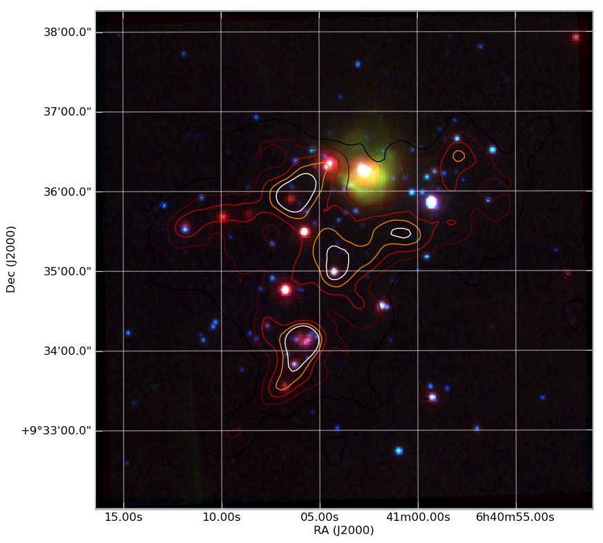

.. include:: ../references.rst

Quick tour of Python
====================

.. Basic:
     read file
     plot histogram
     plot cumulative distribution
     write file
   Numpy / Scipy docs main page: http://docs.scipy.org/doc/
   Modeling / analysis
   Built in numpy funcs (stats, sort)
   SciPy overview http://docs.scipy.org/doc/scipy-0.9.0/reference/
   Curve fit example
   Synthetic images
   Compiled extensions
   HDF5 (Read 100 million data rows, beyond capability of TOPCAT) (live demo)
   Esaview (live demo)
   CygOb2 aeview.py
   C-COSMOS browse (live demo)
   
In the spirit of this workshop let's jump in to real Python analysis code.
These examples assume you are using `pylab
<http://matplotlib.sourceforge.net/faq/usage_faq.html#matplotlib-pylab-and-pyplot-how-are-they-related>`_
(you'll understand what that is after the 2nd hands-on session).

Making a publication quality image
----------------------------------

Making a publication quality image is a snap in Python using the `APLpy
<http://aplpy.github.com>`_ package.  Images can be made interactively or
(reproducibly) with a script.  Let's see how the cover image for today's
talk was made.

::

  import aplpy

  # Convert all images to common projection
  aplpy.make_rgb_cube(['m1.fits', 'i3.fits', 'i2.fits'], 'rgb.fits')

  # Make 3-color image
  aplpy.make_rgb_image('rgb.fits', 'rgb.png', 
                       vmin_r=20, vmax_r=400,
                       vmin_g=0, vmax_g=150, 
                       vmin_b=-2,vmax_b=50)

  # Create a new figure
  fig = aplpy.FITSFigure('rgb_2d.fits')

  # Show the RGB image
  fig.show_rgb('rgb.png')

  # Add contours
  fig.show_contour('sc.fits', cmap='gist_heat', levels=[0.2,0.4,0.6,0.8,1.0])

  # Overlay a grid
  fig.add_grid()
  fig.grid.set_alpha(0.5)

  # Save image
  fig.save('plot.png')

This produces the nice image:

Hello, world
------------

The following is from "myfile.py".  
::

    def hello(name="John"):
        print "Hello, "+name
                                                                                
    def array_hello(names=["Tom", "Dick", "Harry"]):
        for name in names:
            print "Hello, "+name

Run the functions by inside python typing
::

>>> import myfile
>>> myfile.hello()
>>> myfile.array_hello()

Reading text files and plotting 
-------------------------------

Plot the space and redshift distribution of the luminous red galaxies
(LRGs) from the catalogue here:
http://www.2slaq.info/2SLAQ_LRG_v5pub.cat::

  import numpy as np
  import matplotlib.pyplot as plt
  from scipy import integrate
  from math import sqrt
   
  # Cosmological parameters needed to convert redshift to distance   
  H0 = 70.    # Hubble parameter at z=0, km/s/Mpc
  omega_m = 0.3
  omega_lam = 0.7
  c_kms = 299792.458 # speed of light, km/s
  dH = c_kms / H0    # Hubble distance, Mpc
   
  def inv_efunc(z):
      """ Used to calculate the comving distance to object at redshift
      z. Eqn 14 from Hogg, astro-ph/9905116."""
      zp1 = 1. + z
      return 1. / sqrt(omega_m*zp1**3 + omega_lam)
   
  # Read the LRG positions, magnitudes and redshifts
  #
  # dtype=None means the type of each column (float, integer, string)
  # will be guessed. 
  r = np.genfromtxt('2SLAQ_LRG_v5pub.cat', dtype=None, skip_header=176,
                    names='name,z,rmag,RA,Dec',usecols=(0, 12, 26, 27, 28))
   
  r = r[r['z'] > 0.1]
   
  # calculate comoving distance corresponding to each object's redshift
  dist = np.array([dH * integrate.quad(inv_efunc, 0, z)[0] for z in r['z']])
   
  # plot the distribution of LRGs, converting redshifts to positions
  # assuming Hubble flow.
  theta = r['RA'] * np.pi / 180  # radians
  x = dist * np.cos(theta)
  y = dist * np.sin(theta)

  # make the area of each circle representing an LRG position
  # proportional to its apparent r-band luminosity
  sizes = 30 * 10**-((r['rmag'] - np.median(r['rmag']))/ 2.5)   
  fig = plt.figure()
  ax = fig.add_subplot(111)
  # Color each LRG by its declination
  col = ax.scatter(x, y, marker='.', s=sizes, c=r['Dec'], faceted=0,
                   cmap=plt.cm.Spectral)
  cax = fig.colorbar(col)
  cax.set_label('Declination (degrees)')
  ax.set_xlabel('Comoving Mpc')
  ax.set_ylabel('Comoving Mpc')
  ax.axis('equal')

  # Now plot the redshift distribution
  zbins = np.arange(0.25, 0.9, 0.05)
  fig = plt.figure()
  ax = fig.add_subplot(111)
  ax.hist(r['z'], bins=zbins)
  ax.set_xlabel('LRG redshift')
   
  # Make a second axis to plot the comoving distance
  ax1 = plt.twiny(ax)
   
  # Generate redshifts corresponding to distance tick positions;
  # first get a curve giving Mpc as a function of redshift
  redshifts = np.linspace(0, 2., 1000)
  dist = [dH * integrate.quad(inv_efunc, 0, z)[0] for z in redshifts]
  Mpcvals = np.arange(0, 4000, 500)
  # Then interpolate to the redshift values at which we want ticks
  Mpcticks = np.interp(Mpcvals, dist, redshifts)
  ax1.set_xticks(Mpcticks)
  ax1.set_xticklabels([str(v) for v in Mpcvals])
  # Make both axes have the same start and end point.
  ax1.set_xlim(*ax.get_xlim())
  ax1.set_xlabel('Comoving distance (Mpc)')

  plt.show()

Making a fancy plot from Monte-Carlo samples
----------------------------------

Assume you have run an MCMC and you are left with two arrays X,Y of
MCMC samples of two fit parameters. You now want to use X,Y to
visualise the likelihood manifold. You can do that (a) as a simple
scatter plot or (b) in a more fancy way::

  import numpy,math
  import pylab

  # Create artificial data mimicking some MCMC results.
  N = 50000
  X = numpy.random.normal(0.0, 1.5, N)  # Normal distribution
  Y = numpy.random.gamma(2.0, 2.0, N)   # Gamma distribution

  # Define plot ranges once, for multiple usage later (e.g. more than a single subplot).
  XRANGE = [-6.4,6.4]
  YRANGE = [-2.4,11.4]

  # Define figure size and formatting
  fig = pylab.figure(1, figsize=(16,7.5))
  fig.subplots_adjust(wspace=0.2, left=0.04, bottom=0.07, top=0.99, right=0.99)

  # Two subplots next to each other. Start with left subplot.
  pylab.subplot(121)
  # Simply plot X vs. Y as data points.
  pylab.plot(X, Y, 'o', ms=4, alpha=0.1, color='blue')

  pylab.xlim(XRANGE)
  pylab.ylim(YRANGE)
  pylab.xticks(fontsize=16)
  pylab.yticks(fontsize=16)
  pylab.xlabel(r'$x$', fontsize=24)
  pylab.ylabel(r'$y$', fontsize=24)

  # Next, make right subplot.
  pylab.subplot(122)

  # Convert to 2d histogram.
  B      = 25
  hist2D = numpy.histogram2d(X, Y, bins=[B,B], range=[XRANGE,YRANGE], normed=False)[0]

  # Plot Monte-Carlo samples as 2D histogram.
  # Beware: imshow switches axes, so switch back.
  hist2D = numpy.transpose(hist2D)
  pylab.imshow(hist2D, cmap=pylab.cm.gray, interpolation='gaussian')

  # Overplot with error contours 1,2,3 sigma.
  maximum    = numpy.max(hist2D)
  # Infering correct levels of 1,2,3 sigma would require some further code,
  # so let's fake it by setting the three levels to some guessed values.
  [L1,L2,L3] = [0.5*maximum,0.25*maximum,0.125*maximum]
  #print [L1,L2,L3]
  cs = pylab.contour(hist2D, levels=[L1,L2,L3], linestyles=['--','--','--'], colors=['orange','orange','orange'], linewidths=1)
  # use dictionary in order to assign my own labels to the contours.
  fmtdict = {L1:r'$1\sigma$',L2:r'$2\sigma$',L3:r'$3\sigma$'}
  pylab.clabel(cs, fmt=fmtdict, inline=True, fontsize=20)

  # Also plot marginal likelihoods.
  S  = 101
  I  = []
  # Bin X,Y separately. As 1D bin, can use more bins now.
  LX = numpy.histogram(X, bins=S, range=XRANGE, normed=True)[0]
  LY = numpy.histogram(Y, bins=S, range=YRANGE, normed=True)[0]
  # Rescale by maxima. Don't want this histogram to span whole subplot.
  rescale_X = 0.15*float(B)/numpy.max(LX)
  rescale_Y = 0.15*float(B)/numpy.max(LY)
  for s in range(S):
	  I.append(float(s)*float(B)/float(S))
	  LX[s] = LX[s]*rescale_X
	  LY[s] = LY[s]*rescale_Y
  pylab.plot(I, LX, '-', lw=3, color='white')
  pylab.plot(LY, I, '-', lw=3, color='white')

  pylab.xlim(0,B-1)
  pylab.ylim(0,B-1)

  # Sadly, through binning numpy looses the position information, so we need to restore it manually
  # in order to plot proper axes ticks.
  T = []
  L = []
  for x in -6,-4,-2,0,2,4,6:
	  index = (x-XRANGE[0])*float(B-1)/(XRANGE[1] - XRANGE[0])
	  T.append(index)
	  L.append(x)
  pylab.xticks(T, L, fontsize=16)

  T = []
  L = []
  for y in -2,0,2,4,6,8,10:
	  index = (y-YRANGE[0])*float(B-1)/(YRANGE[1] - YRANGE[0])
	  T.append(index)
	  L.append(y)
  pylab.yticks(T, L, fontsize=16)

  pylab.xlabel(r'$x$', fontsize=24)
  pylab.ylabel(r'$y$', fontsize=24)

  pylab.savefig('plot_MCMC_samples.png')  # Save figure as png-file.
  pylab.show()

.. image:: ../examples/plot_MCMC_samples.png
   :scale: 60%

Parallel process of FITS images
-------------------------------

::

    import glob
    import multiprocessing

    import pyfits
    from scipy.ndimage import gaussian_filter

    # Define a function to run on files
    def smooth(filename):

        # Read in FITS file
        hdulist = pyfits.open(filename)

        # Convolve the data in the primary HDU
        hdulist[0].data = gaussian_filter(hdulist[0].data, 3)

        # Write out the result to a new file
        hdulist.writeto(filename.replace('.fits', '_smooth.fits'))

    # Search for all FITS files
    files = glob.glob('files/*.fits')

    # Define a 'pool' of 16 processors
    p = multiprocessing.Pool(processes=16)

    # Run the function over all files in parallel
    ap.map(smooth, files)

Reading a table and plotting with asciitable
--------------------------------------------

The Fermi Gamma-ray satellite has a nice catalog of AGN available through
HEASARC.  The script below will read in the catalog data using the `asciitable`_
module, do some basic filtering with `NumPy`_, and make a couple of plots with
`matplotlib`_ ::

  import asciitable   # Make external package available

  # Read table.  
  # ==> dat[column_name] and dat[row_number] both valid <==
  dat = asciitable.read('fermi_agn.dat')

  redshift = dat['redshift']    # array of values from 'redshift' column
  flux = dat['photon_flux']
  gamma = dat['spectral_index']

  # Select rows that have a measured redshift
  with_z = (redshift != -999)

  figure(1)
  semilogx(flux, gamma, '.b', label='All')  # First plot!
  semilogx(flux[with_z], gamma[with_z], 'or', label='With Z')
  legend(numpoints=1)
  grid()
  xlabel('Flux (photon/cm$^2$/s)')   # latex works
  ylabel('Spectral index $\Gamma$')

  # Select low- and high-z samples
  lowz = with_z & (redshift < 0.8)
  highz = with_z & (redshift >= 0.8)

  figure(2)
  bins = arange(1.2, 3.0, 0.1)    # values from 1.2 to 3.0 by 0.1
  hist(gamma[lowz], bins, color='b', alpha=0.5, label='z < 0.8')
  hist(gamma[highz], bins, color='r', alpha=0.5, label='z > 0.8')
  xlabel('Spectral index $\Gamma$')
  title('$\Gamma$ for low-z and high-z samples')
  legend(loc='upper left')

  asciitable.write(dat[with_z], 'fermi_agn_with_z.dat')

.. image:: hist.png
   :scale: 70%

Curve fitting with SciPy
------------------------

`SciPy`_ provides `curve_fit
<http://docs.scipy.org/doc/scipy/reference/generated/scipy.optimize.curve_fit.html>`_,
a simple and useful implementation of the Levenburg-Marquardt non-linear
minimization algorithm.  This example shows a code to generate a fake dataset
and then fit with a gaussian, returning the covariance matrix for parameter
uncertainties.

::

  from scipy.optimize import curve_fit

  # Create a function
  # ==> First encounter with *whitespace* in Python <==
  def gaussian(x, a, b, c):
      val = a * exp(-(x - b)**2 / c**2)
      return val

  # Generate fake data.
  # Note: functions in random package, array arithmetic (exp)
  n = 100
  x = random.uniform(-10., 10., n)  
  y = exp(-(x - 3.)**2 / 4) * 10. + random.normal(0., 2., n)
  e = random.uniform(0.1, 1., n)

  # Fit
  popt, pcov = curve_fit(gaussian, x, y, sigma=e)

  # Print results
  print "Scale =  %.3f +/- %.3f" % (popt[0], sqrt(pcov[0, 0]))
  print "Offset = %.3f +/- %.3f" % (popt[1], sqrt(pcov[1, 1]))
  print "Sigma =  %.3f +/- %.3f" % (popt[2], sqrt(pcov[2, 2]))

  # Plot data
  errorbar(x, y, yerr=e, linewidth=1, color='black', fmt=None)

  # Plot model
  xm = linspace(-10., 10., 100)  # 100 evenly spaced points
  plot(xm, gaussian(xm, popt[0], popt[1], popt[2]))

  # Save figure
  savefig('fit.png')
   
The plotted fit result is as shown below:

.. image:: fit.png
   :scale: 50%

Intermission: NumPy, Matplotlib, and SciPy
------------------------------------------

These three packages are the workhorses of scientific Python.  

- `NumPy`_ is the fundamental package for scientific computing in Python [`NumPy Reference
  <http://docs.scipy.org/doc/numpy/reference/>`_]
- `Matplotlib`_ is one of many plotting packages.  Started as a Matlab clone.
- `SciPy`_ is a collection of mathematical algorithms and convenience
  functions [`SciPy Reference <http://docs.scipy.org/doc/scipy/reference/>`_]

Synthetic images
----------------

This example demonstrates how to create a synthetic image of a cluster,
including convolution with a Gaussian filter and the addition of noise.
::

  import pyfits
  from scipy.ndimage import gaussian_filter

  # Create empty image
  nx, ny = 512, 512
  image = zeros((ny, nx))

  # Set number of stars
  n = 10000

  # Generate random positions
  r = random.random(n) * nx
  theta = random.uniform(0., 2. * pi, n)

  # Generate random fluxes
  f = random.random(n) ** 2

  # Compute position
  x = nx / 2 + r * cos(theta)
  y = ny / 2 + r * sin(theta)

  # Add stars to image
  # ==> First for loop and if statement <==
  for i in range(n):
      if x[i] >= 0 and x[i] < nx and y[i] >= 0 and y[i] < ny:
          image[y[i], x[i]] += f[i]

  # Convolve with a gaussian
  image = gaussian_filter(image, 1)

  # Add noise
  image += random.normal(3., 0.01, image.shape)

  # Write out to FITS image
  pyfits.writeto('cluster.fits', image, clobber=True)

The simulated cluster image is below:

Running existing compiled codes
-------------------------------

In addition to just doing computations and plotting, Python is great for gluing
together other codes and doing system type tasks.

::

  import os
  import asciitable

  smoothing = 30  # Smoothing window length
  freqs = [2, 4]  # Frequency values for making data
  noises = [1, 5] # Noise amplitude inputs

  figure(1)
  clf()

  # Loop over freq and noise values, running standalone code to create noisy data
  # and smooth it.  Get the data back into Python and plot.
  plot_num = 1
  for freq in freqs:
      for noise in noises:
          # Run the compiled code "make_data" to make data as a list of x, y, y_smooth
          cmd = 'make_data %s %s %s' % (freq, noise, smoothing)
          print 'Running', cmd
          out = os.popen(cmd).read()
          # out now contains the output from <cmd> as a single string

          # Write the output to a file
          filename = 'data_%s_%s' % (freq, noise)
          open(filename, 'w').write(out)

          # Parse the output string as a table
          dat = asciitable.read(out)

          # Make a plot
          subplot(2, 2, plot_num)
          plot(dat['x'], dat['y'])
          plot(dat['x'], dat['y_smooth'], linewidth=3, color='r')

          plot_num += 1

.. image:: run_codes.png
   :scale: 70%

And much much more...
----------------------

- Fast access to big (1e9 rows) tables with `PyTables
  <http://www.pytables.org>`_ + `HDF5 <http://www.hdfgroup.org/HDF5/>`_
- 3-d plotting and surface rendering with `Mayavi <http://mayavi.sourceforge.net/>`_
- Sophisticated data modeling with advanced statistics with `Sherpa 
  <http://cxc.harvard.edu/sherpa/>`_
- `Query VO tables
  <http://www.astropython.org/blog/2011/3/Querying-tables-in-the-virtual-observatory>`_
  and `broadcast <https://gist.github.com/855678>`_ or 
  `retrieve <https://gist.github.com/855678>`_ tables to VO applications like 
  `TOPCAT`_.  
- GUI application to quickly view thousands of X-ray survey image cutouts
- Python-based web site for browsing a complex multi-wavelength survey
- `Thermal modeling of the Chandra X-ray satellite 
  <http://conference.scipy.org/scipy2010/slides/tom_aldcroft_chandra.pdf>`_
- Interactive multi-user plots accessed through a web browser (!)
- Distributed computing with `MPI for Python <http://mpi4py.scipy.org/>`_
- Make a little `video distribution web site <http://youtube.com>`_
