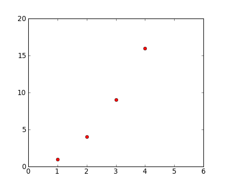
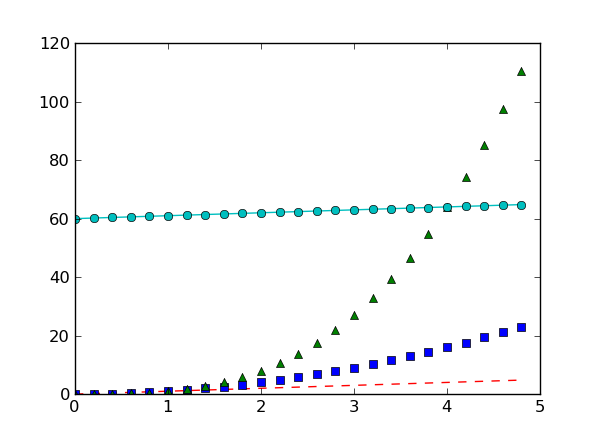
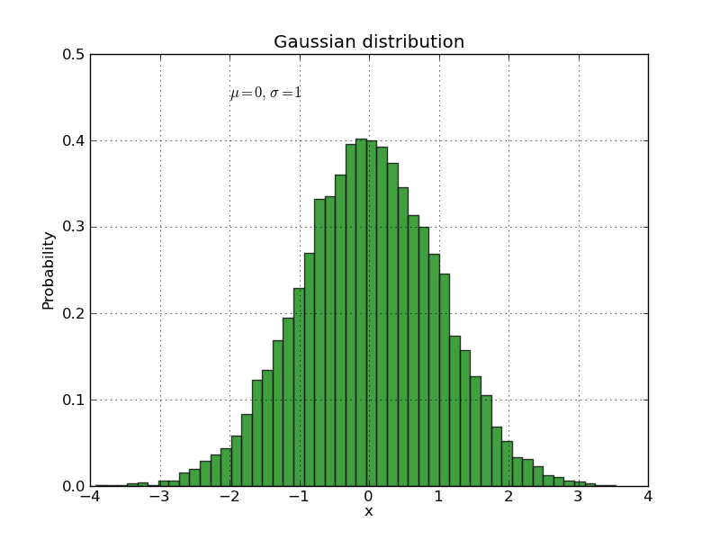
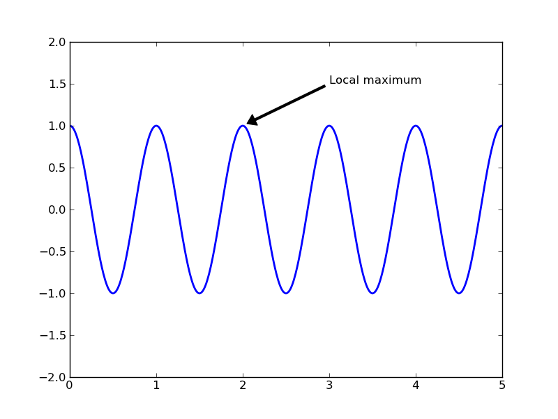
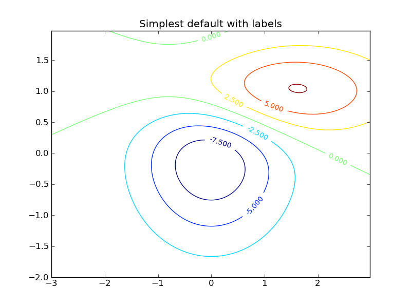

.. include:: ../references.rst

.. NOTES on content for this workshop

.. _`rc()`: http://matplotlib.sourceforge.net/api/pyplot_api.html#matplotlib.pyplot.rc
.. _`plot()`: http://matplotlib.sourceforge.net/api/pyplot_api.html#matplotlib.pyplot.plot
.. _`subplots_adjust()`: http://matplotlib.sourceforge.net/api/pyplot_api.html#matplotlib.pyplot.subplots_adjust
.. _`hist()`: http://matplotlib.sourceforge.net/api/pyplot_api.html#matplotlib.pyplot.hist
.. _`axis()`: http://matplotlib.sourceforge.net/api/pyplot_api.html#matplotlib.pyplot.axis
.. _`cla()`: http://matplotlib.sourceforge.net/api/pyplot_api.html#matplotlib.pyplot.cla
.. _`clf()`: http://matplotlib.sourceforge.net/api/pyplot_api.html#matplotlib.pyplot.clf
.. _`title()`: http://matplotlib.sourceforge.net/api/pyplot_api.html#matplotlib.pyplot.title
.. _`gca()`: http://matplotlib.sourceforge.net/api/pyplot_api.html#matplotlib.pyplot.gca
.. _`gcf()`: http://matplotlib.sourceforge.net/api/pyplot_api.html#matplotlib.pyplot.gcf
.. _`subplot()`: http://matplotlib.sourceforge.net/api/pyplot_api.html#matplotlib.pyplot.subplot
.. _`axes()`: http://matplotlib.sourceforge.net/api/pyplot_api.html#matplotlib.pyplot.axes
.. _`xlabel()`: http://matplotlib.sourceforge.net/api/pyplot_api.html#matplotlib.pyplot.xlabel
.. _`ylabel()`: http://matplotlib.sourceforge.net/api/pyplot_api.html#matplotlib.pyplot.ylabel
.. _`text()`: http://matplotlib.sourceforge.net/api/pyplot_api.html#matplotlib.pyplot.text
.. _`setp()`: http://matplotlib.sourceforge.net/api/pyplot_api.html#matplotlib.pyplot.setp
.. _`close()`: http://matplotlib.sourceforge.net/api/pyplot_api.html#matplotlib.pyplot.close
.. _`figure()`: http://matplotlib.sourceforge.net/api/pyplot_api.html#matplotlib.pyplot.figure
.. _`annotate()`: http://matplotlib.sourceforge.net/api/pyplot_api.html#matplotlib.pyplot.annotate
.. _`matplotlib.pyplot`: http://matplotlib.sourceforge.net/api/pyplot_api.html#matplotlib-pyplot
.. _`marker`: http://matplotlib.sourceforge.net/api/artist_api.html#matplotlib.lines.Line2D.set_marker
.. _`Line2D`: http://matplotlib.sourceforge.net/api/artist_api.html#matplotlib.lines.Line2D
.. _`autoscale()`: http://matplotlib.sourceforge.net/api/pyplot_api.html?highlight=plot.autoscale#matplotlib.pyplot.autoscale
.. _`hold()`: http://matplotlib.sourceforge.net/api/pyplot_api.html?highlight=plot.hold#matplotlib.pyplot.hold
.. _`ioff()`: http://matplotlib.sourceforge.net/api/pyplot_api.html?highlight=plot.ioff#matplotlib.pyplot.ioff
.. _`ion()`: http://matplotlib.sourceforge.net/api/pyplot_api.html?highlight=plot.ion#matplotlib.pyplot.ion
.. _`xlim()`: http://matplotlib.sourceforge.net/api/pyplot_api.html?highlight=plot.xlim#matplotlib.pyplot.xlim
.. _`ylim()`: http://matplotlib.sourceforge.net/api/pyplot_api.html?highlight=plot.ylim#matplotlib.pyplot.ylim
.. _`xticks()`: http://matplotlib.sourceforge.net/api/pyplot_api.html?highlight=plot.xticks#matplotlib.pyplot.xticks
.. _`yticks()`: http://matplotlib.sourceforge.net/api/pyplot_api.html?highlight=plot.yticks#matplotlib.pyplot.yticks

============
 Matplotlib
============

`Matplotlib`_ is a python 2-d plotting library which produces
publication quality figures in a variety of formats and interactive
environments across platforms.  Matplotlib can be used in Python
scripts, the Python and IPython shell, web application servers, and
six graphical user interface toolkits.

Documentation
=============

The matplotlib documentation is extensive and covers all the functionality in
detail.  The documentation is littered with hundreds of examples showing a plot and the
exact source code making the plot:

- `Matplotlib home page <http://matplotlib.sourceforge.net/>`_: key
  pylab plotting commands in a table.
- `Matplotlib manual
  <http://matplotlib.sourceforge.net/contents.html>`_
- `Thumbnail gallery
  <http://matplotlib.sourceforge.net/gallery.html>`_: hundreds of
  thumbnails linking to the source code used to make them (find a plot
  like the one you want to make).
- `Code examples <http://matplotlib.sourceforge.net/examples/>`_:
  extensive examples showing how to use matplotlib commands.

.. - `Text intro
..   <http://matplotlib.sourceforge.net/users/text_intro.html#text-intro>`_:
..   manipulate text
.. - `Mathematical expressions
..   <http://matplotlib.sourceforge.net/users/mathtext.html#mathtext-tutorial>`_:
..   put math in figure text or labels
.. - `Screenshots
..   <http://matplotlib.sourceforge.net/users/screenshots.html>`_:
..   screenshots and code for about 20 key types of matplotlib
..   functionality

Hints on getting from here (an idea) to there (a plot)
------------------------------------------------------

- Start with `Screenshots
  <http://matplotlib.sourceforge.net/users/screenshots.html>`_ section
  of the manual for a broad idea of the plotting capabilities
- Most of the high-level plotting functions are in the ``pyplot``
  module and you can find them quickly by searching for
  ``pyplot.<function>``, e.g. ``pyplot.errorbar``.

.. admonition::  Pylab and Pyplot and NumPy

  Let's demystify what's happening when you use ``ipython --pylab`` and
  clarify the relationship between **pylab** and **pyplot**.

  `matplotlib.pyplot`_ is a collection of command style functions that make
  matplotlib work like MATLAB.  This is just a package module that you can import::

    import matplotlib.pyplot
    print sorted(dir(matplotlib.pyplot))

  Likewise pylab is also a module provided by matplotlib that you can import::

    import pylab

  This module is a thin wrapper around ``matplotlib.pylab`` which pulls in:

  - Everything in ``matplotlib.pyplot``
  - All top-level functions ``numpy``,``numpy.fft``, ``numpy.random``,
  - ``numpy.linalg``
  - A selection of other useful functions and modules from matplotlib

  There is no magic, and to see for yourself do

  .. sourcecode:: python

     import matplotlib.pylab
     matplotlib.pylab??       # prints the source code!!

  When you do ``ipython --pylab`` it (essentially) just does::

    from pylab import *

  In a lot of documentation examples you will see code like::

    import matplotlib.pyplot as plt  # set plt as alias for matplotlib.pyplot
    plt.plot([1,2], [3,4])

  This is good practice for writing scripts and programs, since it is
  clear that the plot command is from the ``matplotlib.pyplot``
  package. We'll adopt this alias for the examples in our course. But
  once you're familiar with the commands, you can omit the ``plt.``
  when plotting in the interactive ipython shell to reduce the amount
  of typing needed.

  See `Matplotlib, pylab, and pyplot: how are they related?
  <http://matplotlib.sourceforge.net/faq/usage_faq.html#matplotlib-pylab-and-pyplot-how-are-they-related>`_
  for a more discussion on the topic.

Plotting 1-d data
=================

The `matplotlib`_ tutorial on `Pyplot
<http://matplotlib.sourceforge.net/users/pyplot_tutorial.html>`_
(Copyright (c) 2002-2009 John D. Hunter; All Rights Reserved and
`license <http://matplotlib.sourceforge.net/users/license.html>`_) is
an excellent introduction to basic 1-d plotting.  **The content below
has been adapted from the pyplot tutorial source with some changes and
the addition of exercises.**

.. The ``pylab`` mode of `matplotlib`_ is a collection of command
   style functions that make `matplotlib`_ work like matlab.  Each
   ``pylab`` function makes some change to a figure: eg, create a
   figure, create a plotting area in a figure, plot some lines in a
   plotting area, decorate the plot with labels, etc....  ``Pylab`` is
   stateful, in that it keeps track of the current figure and plotting
   area, and the plotting functions are directed to the current axes.
   On the `matplotlib FAQ
   <http://matplotlib.sourceforge.net/faq/index.html>`_ page there is
   a very good discussion on `Matplotlib, pylab, and pyplot: how are
   they related?
   <http://matplotlib.sourceforge.net/faq/usage_faq.html#matplotlib-pylab-and-pyplot-how-are-they-related>`_.

`matplotlib.pyplot`_ is a collection of command style functions that make
matplotlib work like MATLAB.  Each ``pyplot`` function makes some change to a
figure: eg, create a figure, create a plotting area in a figure, plot some
lines in a plotting area, decorate the plot with labels, etc....
`matplotlib.pyplot`_ is stateful, in that it keeps track of the current
figure and plotting area, and the plotting functions are directed to the
current axes::

  plt.figure()          # Make a new figure window
  plt.plot([1,2,3,4])
  plt.ylabel('some numbers')

.. image:: pyplot_simple.png
   :scale: 100
   
You may be wondering why the x-axis ranges from 0-3 and the y-axis
from 1-4.  If you provide a single list or array to the
`plot()`_ command, matplotlib assumes it is a
sequence of y values, and automatically generates the x values for
you.  Since python ranges start with 0, the default x vector has the
same length as y but starts with 0.  Hence the x data are
``[0, 1, 2, 3]``.

`plot()`_ is a versatile command, and will take an arbitrary number of
arguments.  For example, to plot x versus y, you can issue the
command::

    plt.clf()
    plt.plot([1,2,3,4], [1,4,9,16])

`plot()`_ is just the tip of the iceberg for plotting commands and you
should study the page of matplotlib `screenshots
<http://matplotlib.sourceforge.net/users/screenshots.html>`_ to get a
better picture.

.. admonition Clearing the figure with clf()
   From now on we will assume that you know to clear the figure with
   `clf()`_ before entering commands to make the next plot.

For every x, y pair of arguments, there is an optional third argument
which is the format string that indicates the color and line type of
the plot.  The letters and symbols of the format string are from
MATLAB, and you concatenate a color string with a line style string.
The default format string is 'b-', which is a solid blue line.  For
example, to plot the above with red circles, you would issue::

  plt.clf()
  plt.plot([1,2,3,4], [1,4,9,16], 'ro')
  plt.axis([0, 6, 0, 20])

See the `plot()`_ documentation for a complete list of line styles and
format strings.  The `axis()`_ command in the example above takes a
list of ``[xmin, xmax, ymin, ymax]`` and specifies the viewport of the
axes.

If matplotlib were limited to working with lists, it would be of
limited use for numeric processing.  Generally, you will use `NumPy`_
arrays.  In fact, all sequences are converted to numpy arrays
internally.  The example below illustrates a plotting several lines
with different format styles in one command using arrays::

  # evenly sampled time at 200ms intervals
  t = np.arange(0., 5., 0.2)

  # red dashes, blue squares and green triangles
  # then filled circle with connecting line
  plt.clf()
  plt.plot(t, t, 'r--', t, t**2, 'bs', t, t**3, 'g^')
  plt.plot(t, t+60, 'co-')

.. admonition:: Exercise: Plot a sine curve

   Make a plot of a sin curve between 0 and 4*pi shown by a green
   curve. Remember that the value of `pi` and the sine function are in
   the numpy namespace (``np.pi`` and ``np.sin``).

.. raw:: html

   
Click to Show/Hide Solution
 

::

  x = np.linspace(0, 4*np.pi, 100)
  plt.plot(x, np.sin(x), 'g')
  plt.xlim(0, 4*np.pi)
  plt.ylim(1.1, -1.1)

.. raw:: html

   

.. _controlling-line-properties:

Controlling line properties
---------------------------

.. admonition:: What are lines and markers?

   A matplotlib "line" is an object containing a set of points and
   various attributes describing how to draw those points.  The points
   are optionally drawn with "markers" and the connections between
   points can be drawn with various styles of line (including no
   connecting line at all).

Lines have many attributes that you can set: linewidth, dash style,
antialiased, etc; see `Line2D`_.  There are two commonly-used ways to
set line properties:

* Use keyword args::

      x = np.arange(0, 10, 0.25)
      y = np.sin(x)
      plt.clf()
      plt.plot(x, y, linewidth=4.0)

* Use the setter methods of the ``Line2D`` instance.  ``plot`` returns a list
  of lines; eg ``line1, line2 = plot(x1,y1,x2,x2)``.  Below I have only
  one line so it is a list of length 1.  I use tuple unpacking in the
  ``line, = plot(x, y, 'o')`` to get the first element of the list::

      plt.clf()
      line, = plt.plot(x, y, '-')
      line.set_<TAB>

  Now change the line color, noting that in this case you need to
  explicitly redraw::

      line.set_color('m') # change color
      plt.draw()

.. admonition:: Wait, plot() makes a plot and returns a value?

   Take note that plot() both generates the plot you asked for, and
   returns a list of line objects.  This happens for most matplotlib
   plotting commands.  They will generate the image, contours,
   histogram, or whatever you want, and also return an object that you
   can then use to later adjust the properties of the plotted object.

Here are some of the `Line2D`_ properties.

======================  =======================================================
Property                Value Type
======================  =======================================================
alpha			a float that controls the opacity
antialiased or aa	[True | False]
color or c		any matplotlib color
dash_capstyle		['butt' | 'round' | 'projecting']
dash_joinstyle		['miter' | 'round' | 'bevel']
dashes			sequence of on/off ink in points
data			(array xdata, array ydata)
figure			The figure in which the plot was made
label			a string used for the legend (see below)
linestyle or ls		[ '-' | '--' | '-.' | ':' | 'steps' | ...]
linewidth or lw		float value in points
lod			[True | False]
marker		        [ '+' | ',' | '.' | '1' | '2' | '3' | '4' | ... ]
markeredgecolor or mec	any matplotlib color
markeredgewidth or mew	float value in points
markerfacecolor or mfc	any matplotlib color
markersize or ms	float
markevery               None | integer | (startind, stride)
solid_capstyle		['butt' | 'round' |  'projecting']
solid_joinstyle		['miter' | 'round' | 'bevel']
visible			[True | False]
xdata			array
ydata			array
zorder			a number determining the plot order (controls overlaps) 
======================  =======================================================

.. admonition:: Exercise: Make this plot

   .. image:: stars.png
      :scale: 70

   Make a plot that looks similar to the one above. You should be able
   to do this just by using keyword arguments to adjust the plotting
   properties.

.. raw:: html

   
Click to Show/Hide Solution
 

::

   x = [1, 2, 3, 4]
   y = [3, 2, 3, 1]
   plt.clf()
   plt.plot(x, y, '--', linewidth=10)
   plt.plot(x, y, '*r', markeredgecolor='b', markeredgewidth=5, markersize=40)
   plt.xlim(0, 5)
   plt.ylim(0, 4)

.. raw:: html

   

Some useful functions for controlling plotting
==============================================

Here are a few useful matplotlib.pyplot functions:

=============================== ==================================================================
`figure()`_		        Make new figure frame (accepts figsize=(width,height) in inches)
`axis()`_		        Set plot axis limits or set aspect ratio (plus more)
`subplots_adjust()`_	        Adjust the spacing around subplots (fix clipped labels etc)
`xlim()`_, `ylim()`_, `axis()`_ Set x and y axis limits
`xticks()`_, `yticks()`_        Set x and y axis ticks
`savefig`_                      Save a figure as png, pdf, ps, svg, jpg, ...			         
=============================== ==================================================================

.. _multiple-figs-axes:

Working with multiple figures and axes
======================================

MATLAB, and `matplotlib.pyplot`_, have the concept of the current
figure and the current axes.  All plotting commands apply to the
current axes.  The function `gca()`_ returns the current axes (a
:class:`matplotlib.axes.Axes` instance), and `gcf()`_ returns the
current figure (:class:`matplotlib.figure.Figure` instance). Normally,
you don't have to worry about this, because it is all taken care of
behind the scenes.  Below is a script to create two figures where the
first figure has two subplots::

  def f(t):                 
      """Python function to calculate a decaying sinusoid"""
      val = np.exp(-t) * np.cos(2*pi*t)
      return val

  t1 = np.arange(0.0, 5.0, 0.1)
  t2 = np.arange(0.0, 5.0, 0.02)

  plt.figure(1)             # Make the first figure
  plt.clf()
  plt.subplot(211)  # 2 rows, 1 column, plot 1
  plt.plot(t1, f(t1), 'bo', t2, f(t2), 'k')
  plt.title('FIGURE 1')
  plt.text(2, 0.8, 'AXES 211')

  plt.subplot(212)  # 2 rows, 1 column, plot 2
  plt.plot(t2, np.cos(2*pi*t2), 'r--')
  plt.text(2, 0.8, 'AXES 212')

  plt.figure(2)             # Make a second figure
  plt.clf()
  plt.plot(t2, f(t2), '*')
  plt.grid()
  plt.title('FIGURE 2')
  plt.text(2, 0.8, 'AXES 111')

Now return the second plot in the first figure and update it::

  plt.figure(1)             # Select the existing first figure
  plt.subplot(212)          # Select the existing subplot 212
  plt.plot(t2, np.cos(pi*t2), 'g--')   # Add a plot to the axes
  plt.text(2, -0.8, 'Back to AXES 212')

+--------------------------+---------------------------+
|.. image:: mult_figs1.png |.. image:: mult_figs2.png  |
|   :scale: 50             |   :scale: 50              |
+--------------------------+---------------------------+

The first `figure()`_ command here is optional because ``figure(1)``
will be created by default, just as a ``subplot(111)`` will be created
by default if you don't manually specify an axes.

The `subplot()`_ command specifies ``numrows, numcols, fignum`` where
``fignum`` ranges from 1 to ``numrows*numcols``.  The commas in the
``subplot`` command are optional if ``numrows*numcols<10``.  So
``subplot(211)`` is identical to ``subplot(2,1,1)``.  You can create
an arbitrary number of subplots and axes.

If you want to place an axes manually, ie, not on a rectangular grid,
use the `axes()`_ command, which allows you to specify the location as
``axes([left, bottom, width, height])`` where all values are in
fractional (0 to 1) coordinates.  See `pylab_examples-axes_demo
<http://matplotlib.sourceforge.net/examples/pylab_examples/axes_demo.html>`_
for an example of placing axes manually and
`pylab_examples-line_styles
<http://matplotlib.sourceforge.net/examples/pylab_examples/line_styles.html>`_
for an example with lots-o-subplots.

You can clear the current figure with `clf()`_ and the current axes
with `cla()`_.  There is also an object oriented API which you can use
instead (see the `artist tutorial
<http://matplotlib.sourceforge.net/users/artists.html>`_).Briefly,
`subplot` and `axes` have equivalents that are methods of a figure;
`figure().add_subplot()` and `figure().add_axes()`. In scripts it is
often more convenient to use these as it makes explicit which figure
the plot will appear on.

.. _working-with-text:

Text, Histograms and Legends
============================

The `text()`_ command can be used to add text in an arbitrary
location, and the `xlabel()`_, `ylabel()`_ and `title()`_ are used to
add text in the indicated locations (see the `text intro
<http://matplotlib.sourceforge.net/users/text_intro.html#text-intro>`_
for a more detailed example). Here we'll create a histogram from some
data using the `hist_` command and then annotate it with some text::

  mu, sigma = 0, 1
  x = np.random.normal(mu, sigma, size=10000)
  plt.clf()

  # the histogram of the data
  histvals, binvals, patches = plt.hist(
     x, bins=50, normed=1, facecolor='g', alpha=0.75, label='my data')

  plt.xlabel('x')
  plt.ylabel('Probability')
  plt.title('Gaussian distribution')
  plt.text(-2, 0.45, r'$\mu=0,\ \sigma=1$')
  plt.xlim(-4, 4)
  plt.ylim(0, 0.5)
  plt.grid(True)

All of the `text()`_ commands return an :class:`matplotlib.text.Text`
instance.  Just as with with lines above, you can customize the
properties by passing keyword arguments into the text functions or
using `set_` methods::

  t = plt.xlabel('my data', fontsize=14, color='red')

These properties are covered in more detail in `text-properties
<http://matplotlib.sourceforge.net/users/text_props.html>`_. For
example, you can change the alignment of the text with respect to the
coordinates with the `verticalalignment` and `horizontal alignment`
(or `va` and `ha`) keywords::

  plt.text(-2, 0.45, r'$\mu=0,\ \sigma=1$', ha='right', color='g')

We've also added an extra keyword `label` to the ``hist()`` call. This
will be used to label the curve if we later decide to add a
legend. Let's do that now using ``legend()``::

  plt.legend(loc='best')

Type ``legend?`` and take a look at the different keyword options that
let you customise the legend. `loc='best'` means it will magically
choose a location to minimise overlap with the plotted data.

.. admonition:: Exercise: Overlaying histograms

   Make an additional normal distribution with a mean of 1, then make
   a new plot where the two distributions are overlayed.  Use a
   different color and choose the opacities (keyword `alpha`) so it
   looks reasonable. Finally, make a legend that identifies the two
   distributions.

   Hints:

   - You might want to use the ``bin`` parameter with an
     ``np.arange(min, max, step)`` so both histograms are binned the
     same.
   - The ``histtype`` parameter may also prove useful depending on
     your taste.plt.clf()

.. raw:: html

   
Click to Show/Hide Solution
 

::

  plt.clf()
  x2 = np.random.normal(1, 1, size=10000)
  bins = np.arange(-4, 5, 0.2)
  out = plt.hist(x, bins=bins, normed=1, facecolor='g', alpha=0.5, 
                histtype='stepfilled', label=r'$\mu=0,\ \sigma=1$')
  out = plt.hist(x2, bins=bins, normed=1, facecolor='r', alpha=0.5, 
                histtype='stepfilled', label=r'$\mu=1,\ \sigma=1$')
  plt.legend(loc='best')

.. raw:: html

   

Using mathematical expressions in text
======================================

matplotlib accepts TeX equation expressions in any text expression.
For example, to write the expression :math:`\sigma_i=15` in the title
you can write a TeX expression surrounded by dollar signs::

    plt.title(r'$\sigma_i=15$')

The ``r`` preceeding the title string is important -- it signifies
that the string is a *raw* string and not to treate backslashes as
python escapes.  matplotlib has a built-in TeX expression parser and
layout engine, and ships its own math fonts -- for details see the
`mathtext-tutorial
<http://matplotlib.sourceforge.net/users/mathtext.html>`_.  Thus you
can use mathematical text across platforms without requiring a TeX
installation.  For those who have LaTeX and dvipng installed, you can
also use LaTeX to format your text and incorporate the output directly
into your display figures or saved postscript -- see the
`usetex-tutorial
<http://matplotlib.sourceforge.net/users/usetex.html>`_.

Annotating text
===============

The uses of the basic `text()`_ command above place text at an
arbitrary position on the Axes.  A common use case of text is to
annotate some feature of the plot, and the `annotate()`_ method
provides helper functionality to make annotations easy.  In an
annotation, there are two points to consider: the location being
annotated represented by the argument ``xy`` and the location of the
text ``xytext``.  Both of these arguments are ``(x,y)`` tuples::

  plt.clf()
  t = np.arange(0.0, 5.0, 0.01)
  s = np.cos(2*pi*t)
  lines = plt.plot(t, s, lw=2)

  plt.annotate('Local maximum', xy=(2, 1), xytext=(3, 1.5),
           arrowprops=dict(facecolor='black', shrink=0.05, width=2))
  plt.ylim(-2,2)

In this basic example, both the ``xy`` (arrow tip) and ``xytext``
locations (text location) are in data coordinates.  There are a
variety of other coordinate systems one can choose -- see the
`annotations tutorial
<http://matplotlib.sourceforge.net/users/annotations.html>`_. More
examples can be found `here
<http://matplotlib.sourceforge.net/examples/pylab_examples/annotation_demo.html>`_

Making contour plots and saving figures
=======================================

Contour plots can be made using the `contour()` command, and they can
then be labelled with `clabel()`::

  def gaussian_2d(x, y, x0, y0, xsig, ysig):
      return np.exp(-0.5*(((x-x0) / xsig)**2 + ((y-y0) / ysig)**2))
   
  delta = 0.025
  x = np.arange(-3.0, 3.0, delta)
  y = np.arange(-2.0, 2.0, delta)
  X, Y = np.meshgrid(x, y)
  Z1 = gaussian_2d(X, Y, 0., 0., 1., 1.)
  Z2 = gaussian_2d(X, Y, 1., 1., 1.5, 0.5)
  # difference of Gaussians
  Z = 10.0 * (Z2 - Z1)

  # Create a contour plot with labels using default colors.  The
  # inline argument to clabel will control whether the labels are draw
  # over the line segments of the contour, removing the lines beneath
  # the label
  plt.figure()
  CS = plt.contour(X, Y, Z)
  plt.clabel(CS, inline=1, fontsize=10)
  plt.title('Simplest default with labels')

Once you've made plots, they can be saved with `savefig`. They can be
saved as jpg, png, pdf, ps, svg and other formats; the format is
inferred from the suffix of the filename::

  plt.savefig('contour.pdf')

png format is generally best for putting in talks. For papers and
posters it's better to use a vector format like ps, pdf or svg. There
can be small differences between the plot you see on the screen and a
saved pdf or ps version, so check the saved version looks as you
expect. (Often the saved vector format version will look better!)

You can also save a plot using the button in the plotting window.

.. admonition:: Exercise: Make a contour plot

   Make a contour plot of a single 2d gaussian centred on 0,0. You
   should show only 2 contours that are both coloured black. Label the
   inner contour with '99%' and the outer contour with '95%'. You
   might want to take a look at the `fmt` keyword in the `clabel()`
   help to see how to give your own contour labels, and take note that
   the values of each contour level are stored in `CS.levels`.

.. raw:: html

   
Click to Show/Hide Solution
 

::

  x = np.linspace(-2.0, 2.0)
  y = np.linspace(-2.0, 2.0)
  X, Y = np.meshgrid(x, y)
  Z = gaussian_2d(X, Y, 0, 0, 1., 1.)

  plt.figure()
  CS = plt.contour(X, Y, Z, 2, colors='k')
  fmt = {CS.levels[0]: '95%', CS.levels[1]: '99%'}
  plt.clabel(CS, fmt=fmt)
   
.. raw:: html

   

Other 2-d plots
===============

A deeper tutorial on plotting 2-d image data will have to wait for another
day:

- To plot images take a look at at the `image tutorial
  <http://matplotlib.sourceforge.net/users/image_tutorial.html>`_
- `APLpy`_ allows you to easily make publication quality images for
  astronomical fits images incorporating WCS information.

Plotting 3-d data
=================

Matplotlib supports plotting 3-d data through the
``mpl_toolkits.mplot3d`` module.  This is somewhat experimental but
it's worth looking at an example of the 3-d viewer that is available::

  from mpl_toolkits.mplot3d import Axes3D
  import numpy as np
  import matplotlib.pyplot as plt

  def gaussian_2d(x, y):
      return np.exp(-0.5*(x**2 + y**2))

  fig = plt.figure()
  ax = fig.add_subplot(111, projection='3d')
  vals = np.linspace(-3, 3)
  x,y = np.meshgrid(vals, vals)
  z = gaussian_2d(x, y)
  ax.plot_wireframe(x, y, z, color='0.3', lw=0.5)
  ax.set_xlabel('X')
  ax.set_ylabel('Y')
  ax.set_zlabel('Z')

To get more information check out the `mplot3d tutorial
<http://matplotlib.sourceforge.net/mpl_toolkits/mplot3d/tutorial.html>`_.

Putting it all together
-----------------------

Let's use some of what we've learned over the past few lessons to plot
a 2d distribution, overlay some contours, and show the 1d histograms
in corresponding to each dimension. You should understand everything
that's going on here - if you don't, please ask!::
   
  # the random data
  x = np.random.randn(1e5)
  y = np.random.randn(1e5)
   
  # start with a rectangular figure
  plt.figure(figsize=(6, 6))
   
  # define the axes positions
  left = bottom = 0.1
  width = height = 0.7
   
  ax_main = plt.axes([left, bottom, width, height])
  ax_top = plt.axes([left, bottom + height, width, 0.15])
  ax_right = plt.axes([left + width, bottom, 0.15, height])
   
  # plot the data points
  ax_main.plot(x, y, '.', markersize=0.5)
   
  # now let's overplot some contours. First we have to make a 2d
  # histogram of the point distribution.
  vals, xedges, yedges = np.histogram2d(x, y, bins=30)
   
  # Now we have the bin edges, but we want to find the bin centres to
  # plot the contour positions - they're half way between the edges:
  xbins = 0.5 * (xedges[:-1] + xedges[1:])
  ybins = 0.5 * (yedges[:-1] + yedges[1:])
   
  # now plot the contours
  ax_main.contour(xbins, ybins, vals.T, 4, colors='k', zorder=10)
   
  # finally plot 1d histograms for the top and right axes.
  bins = np.arange(-3, 3.1, 0.1)
  ax_top.hist(x, bins=bins, histtype='stepfilled')
  ax_right.hist(y, bins=bins, orientation='horizontal', histtype='stepfilled')   
   
  # make all the limits consistent
  ax_top.set_xlim(-3, 3)
  ax_right.set_ylim(-3, 3)
  ax_main.set_xlim(-3, 3)
  ax_main.set_ylim(-3, 3)
   
  # remove the tick labels for the top and right axes.
  ax_top.set_xticklabels([])
  ax_top.set_yticklabels([])
  ax_right.set_xticklabels([])
  ax_right.set_yticklabels([])
   
  plt.show()
